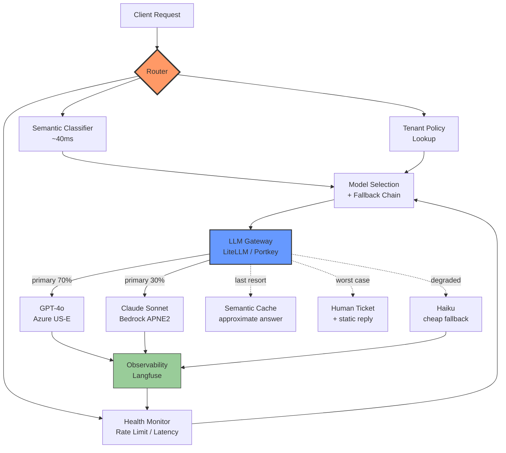

### LLM Routing & Fallback — "GPT-4o에 다 보내면 되지"라는 순진함, 그리고 OpenAI가 47분 다운되자 챗봇 한 통에 $3.20씩 나가던 새벽

> 2025년 12월, 국내 F 커머스의 상담 챗봇이 GPT-4o에 모든 트래픽을 단순 프록시로 흘려보내고 있었다. 월평균 210만 대화 × 평균 4턴 × 2,800토큰 = 월 $42,000. CFO는 참았다. "AI니까." 그러다 12월 11일 오전 3시 47분, OpenAI가 47분간 다운. 챗봇은 "죄송합니다, 일시적 오류입니다"를 47분간 반복. 새벽 배송 문의가 몰리는 시간이었다. CS 유입 12,400건. 트위터 실검. 다음 날 CTO가 정신을 차리고 Claude로 급하게 페일오버를 붙였는데 — 이번엔 Claude Sonnet이 전 요청을 받아 대화 한 통당 $3.20이 청구되기 시작했다. 원인: 라우팅 없이 단순 fallback만 붙였기 때문이다. 12월 청구서는 $89,000이었다.

이 글은 **LLM Gateway가 "어떻게 접근하는가"의 문제라면, Routing/Fallback은 "어떤 모델이 이 요청을 처리해야 하는가"의 문제**라는 관점에서 출발한다. Gateway는 배관공이고, Router는 트래픽 관제사다. 둘은 다른 계층이며, Gateway를 잘 만들어도 Routing 없이는 절대 비용도 안정성도 잡을 수 없다.

---

## 1. 왜 Routing이 별도 계층인가

시니어들이 자주 착각한다. "LiteLLM/Portkey 붙였으니 라우팅도 되잖아?" 아니다. Gateway가 제공하는 건 **정적 라우팅**(model=gpt-4o 명시)과 **단순 fallback**(primary 실패 → secondary)뿐이다. 진짜 문제는 다음이다.

- **비용 최적화**: 70%의 쿼리는 Haiku로 충분한데 왜 Sonnet에 보내는가
- **품질 SLA**: FAQ는 Haiku, 컴플레인은 Opus — 누가 결정하는가
- **가용성**: OpenAI가 리전 단위로 죽었을 때 Claude로 넘어가되, **프롬프트가 두 모델에서 동일한 품질을 낼 것인가**
- **레이트 리밋**: Tier 4까지 올려도 초당 500 req 한계인데, 트래픽 스파이크 때 어디로 흘리는가

Gateway는 이걸 해결하지 못한다. 별도의 **Routing 계층**이 필요하다.

```
┌──────────────────────────────────────────────────────────────┐
│                    Application Layer                          │
│  (chatbot, RAG, agent, batch job — 각자의 SLA/예산)          │
└─────────────────────────────┬────────────────────────────────┘
                              │ 통일된 request
                              ▼
┌──────────────────────────────────────────────────────────────┐
│                    LLM Router (이 글의 주인공)                │
│  ┌──────────────┐  ┌──────────────┐  ┌──────────────────┐   │
│  │  Classifier  │  │  Cost/SLA    │  │  Health/Quota    │   │
│  │  (semantic)  │  │  Policy      │  │  Monitor         │   │
│  └──────┬───────┘  └──────┬───────┘  └────────┬─────────┘   │
│         └─────────────────┼───────────────────┘             │
│                           ▼                                 │
│              [ Decision: 어떤 모델로? ]                      │
│                           │                                 │
│              [ Fallback Chain 준비 ]                        │
└─────────────────────────────┬────────────────────────────────┘
                              ▼
┌──────────────────────────────────────────────────────────────┐
│              LLM Gateway (LiteLLM / Portkey)                  │
│   통일된 SDK, 키 관리, 재시도, 로깅, 관측                     │
└─┬────────────┬────────────┬────────────┬─────────────────────┘
  ▼            ▼            ▼            ▼
Haiku       Sonnet       Opus        GPT-4o-mini    ...
(Bedrock)  (Anthropic)  (Vertex)    (Azure US-E)
```

핵심은 **Router가 Gateway 위에 앉는다**는 것. Gateway는 "어떻게 부를지"를 표준화하고, Router는 "누구를 부를지"를 결정한다.

---

## 2. Routing 전략 4가지 — 언제 무엇을 쓰는가

### 2.1 Cascade Routing — 싼 놈부터 시도

가장 구현이 쉽고, **가장 오해가 많은** 패턴이다. Haiku가 답을 못 내면 Sonnet, 그것도 안 되면 Opus로 에스컬레이션.

```
Query ──► Haiku ──► [confidence > 0.8?] ── Yes ──► 응답
             │              │
             │              No
             │              ▼
             │           Sonnet ──► [confidence > 0.8?] ── Yes ──► 응답
             │              │              │
             │              │              No
             │              │              ▼
             │              │           Opus ──► 응답
             │              │
             └── 실패 ──────┘
```

**함정 1: "confidence"를 어떻게 측정하는가.**
LLM은 자체 신뢰도를 잘 못 낸다. "Are you confident?" 물어보면 대부분 "Yes"다. 실제로는:
- **Judge 모델을 별도로 두거나** (같은 저가 모델은 절대 안 됨 → 중복 편향)
- **정답 예시와의 유사도**를 벡터로 재고, 임계값 밑이면 에스컬레이션
- **Structured output의 스키마 실패**를 트리거로 사용 (실무에서 가장 안정적)

**함정 2: Cascade 지연.**
Haiku 400ms → Sonnet 1.2s → Opus 3.5s. 최악의 경우 5초. 사용자 대기 시간이 폭발한다. 그래서 **Cascade는 배치/비동기 워크로드에만 써야 하고, 실시간 대화형에는 Semantic Routing이 낫다.**

**실제 사례**: Notion AI (2024 tech blog)는 문서 요약 배치 잡에서 Cascade를 쓴다. 대화형 Q&A는 Semantic Router로 처음부터 모델을 정한다.

### 2.2 Semantic Routing — Classifier가 미리 결정

쿼리를 임베딩하고, 사전 정의된 카테고리(FAQ / 상품문의 / 컴플레인 / 코딩 / 창작)로 분류해 모델을 매핑한다.

```python
# 개념 코드 (실제 구현은 latency 민감)
categories = {
    "faq": {"model": "haiku", "max_tokens": 500},
    "product_query": {"model": "sonnet", "max_tokens": 1500},
    "complaint": {"model": "opus", "max_tokens": 2000},  # 실수 = 소송
    "code_gen": {"model": "sonnet", "max_tokens": 4000},
}

query_embedding = embed(query)
category = classify(query_embedding, categories)
model = categories[category]["model"]
```

**Classifier 구현 옵션**:
1. **sentence-transformers + threshold** — 40ms, 정확도 80% 수준
2. **작은 LLM(Haiku)로 분류** — 300ms, 정확도 92%
3. **fine-tuned BERT** — 15ms, 정확도 94% (관리 비용 있음)

시니어의 선택은 **1번(임계값 낮게) + 실패 시 2번 fallback**이다. p50은 40ms로 유지되면서 애매한 쿼리만 LLM 분류로 넘긴다.

**실제 사례**: RouteLLM (LMSYS, 2024 오픈소스)이 이 접근이다. **similarity-based router**로 강한 모델과 약한 모델 사이에서 라우팅해, Chatbot Arena 품질의 95%를 유지하면서 GPT-4 비용의 26%만 사용했다는 논문 결과가 있다.

### 2.3 Cost/Quality Policy Routing — 계약이 결정

**엔터프라이즈에서 가장 많이 쓰지만 논문엔 없는 패턴.**

```yaml
# routing_policy.yaml
policies:
  - tenant: "enterprise_a"
    sla: "premium"
    model_pool: ["opus", "gpt-4o"]
    max_cost_per_query_krw: 500

  - tenant: "sme_b"
    sla: "standard"
    model_pool: ["sonnet", "gpt-4o-mini"]
    max_cost_per_query_krw: 50

  - tenant: "internal_batch"
    sla: "best_effort"
    model_pool: ["haiku"]
    max_cost_per_query_krw: 5
```

Router는 요청의 tenant/context에서 정책을 찾아 pool을 결정하고, pool 내에서 **health-aware round-robin**을 돈다.

**왜 이게 시니어의 답인가**: 비용은 **쿼리 단위가 아니라 계약 단위로 관리해야 한다**. CFO는 "챗봇 API 비용"이 아니라 "고객사 A의 마진율"이 궁금하다. Semantic Router는 이 관점을 못 준다.

### 2.4 Load-based Routing — Rate Limit 회피

Anthropic Tier 4, OpenAI Tier 5까지 올려도 초당 요청 한도가 있다. 스파이크 시:
- **동일 모델의 여러 프로바이더**로 흘리기 (Claude on Anthropic API + Claude on Bedrock + Claude on Vertex)
- **동급 다른 모델**로 흘리기 (Sonnet ↔ GPT-4o)
- **큐에 잠깐 담기** (대화형은 안 됨, 배치만)

핵심은 **remaining quota를 실시간으로 아는 것**. Anthropic은 응답 헤더에 `anthropic-ratelimit-requests-remaining`을 준다. Router는 이걸 집계해 라우팅 결정에 반영해야 한다.

---

## 3. Fallback Chain — 왜 "그냥 다음 모델"이 위험한가

앞선 F 커머스 사례가 정확히 이 함정이다. **단순 fallback은 재앙을 배로 만든다.**

```
❌ 순진한 Fallback
Primary: GPT-4o
Secondary: Claude Sonnet
Tertiary: Gemini Pro
```

이렇게 짜면 OpenAI 다운 시 **전체 트래픽이 Claude로 밀린다**. Claude는:
1. Rate limit이 즉시 터짐 → 3번째로 밀림 → Gemini도 터짐 → 결국 다 죽음
2. 살아남아도 **Sonnet 요금**이 전 요청에 적용 → 비용 폭발
3. 프롬프트 튜닝이 GPT-4o 기준이라 **품질이 30% 떨어진 상태**로 응답

시니어의 Fallback은 이렇게 짠다.

```
Primary Pool: [GPT-4o, Claude Sonnet] (weighted 70/30, 상시 분산)
   │
   ├── 한쪽 실패 시: 다른 쪽으로 자동 흡수 (이미 프롬프트 검증됨)
   │
   └── Pool 전체 degraded 시:
        │
        ├── (a) Cheaper Fallback: Haiku/GPT-4o-mini로 다운그레이드
        │        + 응답에 "간이 답변" 명시
        │
        ├── (b) Cache Fallback: Semantic Cache에서 근사 답변
        │        (Semantic Cache의 진짜 존재 이유가 여기)
        │
        └── (c) Static Fallback: "지금 답변 드리기 어렵습니다.
                 문의 남기시면 30분 내 연락드립니다" + 티켓 자동 생성
```

**핵심 원칙 3가지**:
1. **상시 분산이 최고의 fallback이다** — 이미 두 모델을 쓰고 있으면 한쪽이 죽어도 나머지가 이어받는다. 프롬프트 검증도 이미 되어 있다.
2. **Degradation은 명시적이어야 한다** — 사용자에게 "간이 답변입니다"를 알리는 게 낫다. Opus 응답인 척하고 Haiku가 답하면 브랜드 신뢰가 무너진다.
3. **최후의 폴백은 인간이다** — 티켓 자동 생성이 "죄송합니다"보다 낫다.

---

## 4. 전체 아키텍처 — Mermaid로 보는 통합



Router가 관제탑, Gateway가 배관, Observability가 피드백 루프. 이 셋이 붙어 있어야 진짜 **자기 치유형 LLM 인프라**가 된다.

---

## 5. 실제 사례 — 누가 왜 이렇게 짓는가

### 사례 1: Martian (2024, YC 스타트업)
**"LLM용 CDN"을 자칭**한다. Semantic + Cost routing을 SaaS로 판다. 도입 고객사에서 평균 **비용 45% 절감, 품질 유지**를 보고했다. 왜 이게 SaaS가 되는가? — **라우팅 정책의 학습에 트래픽 데이터가 필요**한데, 개별 회사는 데이터가 부족하다. Martian은 크로스 고객 데이터로 정책을 미리 학습해 파는 구조다. (프라이버시 논쟁이 있다.)

### 사례 2: RouteLLM (LMSYS, 2024 오픈소스)
논문으로도 나온 학술적 접근. **"강한 모델과 약한 모델 사이의 라우팅"** 하나에만 집중. Chatbot Arena 데이터로 학습한 causal LLM classifier가 쿼리 난이도를 예측하고, 임계값 밑이면 약한 모델로 보낸다. **GPT-4 대비 26% 비용, 품질 95% 유지.** 학습 데이터 공개, 재현 가능.

### 사례 3: Anthropic Claude Code 자체 (2024–2026)
Claude Code는 내부적으로 **작업 유형별로 다른 Claude 모델**을 쓴다. 짧은 결정(파일 읽기 판단)은 Haiku, 코드 생성은 Sonnet, 복잡한 아키텍처는 Opus. 이걸 사용자가 몰라도 작동하는 이유는 **Router가 tool call과 컨텍스트 길이를 보고 자동 선택**하기 때문. Anthropic 자체가 자사 제품에서 Multi-Model Routing을 dogfooding하고 있다.

### 사례 4: 국내 F 커머스 (도입부의 그 회사, 2026 리팩토링)
$89K 청구서 사건 후 3주간 리팩토링. 최종 구조:
- **Primary Pool**: GPT-4o-mini(Azure) 60% + Haiku(Bedrock APNE2) 40% — 상시 분산
- **Escalation**: Structured output 스키마 실패 시 → Sonnet
- **Degradation**: Pool 전체 헬스 <60% 시 → Semantic Cache로 폴백
- **최후**: Cache miss 시 → 상담원 티켓 자동 생성
- **결과**: 월 비용 $12,400 (69% 절감), 가용성 99.94% → 99.99%, CS 유입은 오히려 감소

### 사례 5: 국내 G 보험사 (2025) — Routing 없이 실패한 케이스
반대 사례. LLM Gateway(LiteLLM)만 도입하고 "라우팅은 나중에"로 미뤘다. 6개월 뒤 월 청구서 $34K, CFO가 "챗봇 하나에 왜 이만큼이냐"고 프로젝트 kill을 논의. 프로덕트팀이 급하게 Semantic Router를 3주 만에 붙였고 비용은 $11K로 내려갔다. **Gateway ≠ Router라는 걸 6개월 늦게 배운 대가.**

---

## 6. 트레이드오프 — 시니어의 판단 기준

| 관점 | Router 없이 (Gateway만) | Router 도입 |
|---|---|---|
| **초기 구현** | 1주 | 3–6주 (classifier 학습 포함) |
| **비용** | 최대 3–5배 | 관리 가능 (30–60% 절감) |
| **latency p50** | 낮음 (직접 호출) | +30–80ms (classifier 오버헤드) |
| **latency p99** | 폴백 시 폭발 | 안정 (cache/static 폴백) |
| **가용성** | 프로바이더에 종속 | 자기 치유 |
| **품질 관리** | 단일 모델 튜닝 | **모델별 프롬프트 관리 필요** ← 이게 진짜 비용 |
| **디버깅 난이도** | 쉬움 | 어려움 (어느 모델이 어느 응답을 냈는지 관측 필수) |
| **관측 요구사항** | Gateway 로그면 됨 | Langfuse 같은 trace + eval 필수 |

**"품질 관리" 항목이 진짜 함정**이다. 두 모델을 쓰면 프롬프트를 두 번 유지보수해야 한다. Golden Dataset도 모델별로 돌려야 한다. 이걸 감당할 조직 성숙도가 없으면 Router 도입은 **오히려 부채**가 된다.

---

## 7. 언제 쓰고 언제 쓰면 안 되는가

### ✅ 반드시 도입해야 하는 경우
- 월 LLM 청구서가 **$5,000을 넘고 3개월 이상 지속**될 때
- SLA가 **99.9% 이상** 요구되는데 단일 프로바이더에 의존 중일 때
- **다중 테넌트**(B2B SaaS)에서 계약별 품질/비용이 달라야 할 때
- **쿼리 유형이 명확히 분류 가능**할 때 (FAQ 40%, 복잡 문의 20%처럼)

### ⚠️ 신중해야 하는 경우
- 트래픽이 **일일 1,000 req 이하**일 때 — 관리 오버헤드가 이득보다 큼
- **팀이 5명 이하**일 때 — Prompt Registry, Eval Harness, Observability 3종 세트를 감당 못함
- 쿼리가 **거의 다 같은 성격**일 때 (예: 코딩 어시스턴트) — Semantic 라우팅의 이득이 없음

### ❌ 쓰지 말아야 하는 경우
- **PoC/MVP 단계** — Gateway조차 필요 없다, SDK 직접 호출로 충분
- **레귤레이션이 단일 모델을 강제**할 때 (예: 국내 금융권에서 특정 인증 모델만 허용)
- 조직이 **아직 Eval Harness가 없을 때** — 라우팅 전에 평가부터. 두 모델의 품질을 측정 못하면 라우팅은 도박이다

---

## 8. 주의할 함정 6가지

**함정 1. Classifier latency가 저가 모델 latency보다 크다**
Classifier가 300ms 걸리는데 Haiku가 400ms면, 그냥 Haiku에 다 보내는 게 낫다. **p50 40ms 이하가 아니면 Semantic Routing은 의미 없다.**

**함정 2. 모델별 프롬프트를 하나로 쓴다**
GPT-4o용 프롬프트가 Claude에서 그대로 잘 될 거란 착각. **Claude는 XML 태그를 좋아하고, GPT는 JSON 스키마를 좋아한다.** 모델별로 프롬프트 버전을 따로 관리해야 한다. (Prompt Registry의 진짜 존재 이유가 여기서 드러난다.)

**함정 3. Fallback 시 동일 프롬프트 재전송**
Primary 실패 → Secondary로 넘길 때 **같은 프롬프트를 그대로 보내면** 품질 차이가 사용자에게 노출된다. Secondary용으로 튜닝된 프롬프트를 별도로 유지해야 한다.

**함정 4. Router 자체의 관측 부재**
"Router가 왜 이 쿼리를 Sonnet으로 보냈지?"에 답 못하면 디버깅 지옥이다. **모든 라우팅 결정에 reason과 classifier score를 span으로 태그**해야 한다.

**함정 5. Rate limit을 client-side에서만 관리**
분산 환경에서 각 인스턴스가 자기 quota만 안다. **중앙 Redis에 remaining quota를 집계**하지 않으면 클러스터 전체가 한계를 넘긴다.

**함정 6. Fallback 체인이 순환 참조**
"OpenAI 실패 → Claude, Claude 실패 → OpenAI 재시도"를 짜놓으면 **양쪽이 동시에 죽었을 때 무한 루프**. Circuit Breaker + max_hops 명시 필수.

---

## 9. 시니어가 오늘 할 일

1. **현재 LLM 청구서를 뽑아 모델별로 분해한다.** GPT-4o가 90% 이상이면 라우팅 도입 후보.
2. **최근 1개월 쿼리 1,000개를 샘플링**해 카테고리별 비율을 본다. 상위 3개 카테고리가 60% 이상이면 Semantic Router로 이득이 크다.
3. **프로바이더 다운타임 히스토리**를 확인한다. 지난 6개월 동안 2회 이상 30분 이상 다운이 있었다면 Fallback Chain은 이미 늦었다.
4. **Eval Harness부터 확인한다.** 없다면 라우팅 이야기 전에 Golden Set + Eval부터. 라우팅은 평가가 있는 조직만 도입해야 한다.

> 💡 **왜 중요한가**: LLM Gateway는 "어떻게 부를지"의 표준화이고, LLM Router는 "누구를 부를지"의 지능화다 — 이 둘을 구분하지 못하면 청구서가 매출을 넘고, 프로바이더 하나가 죽는 새벽에 서비스 전체가 멈춘다.
