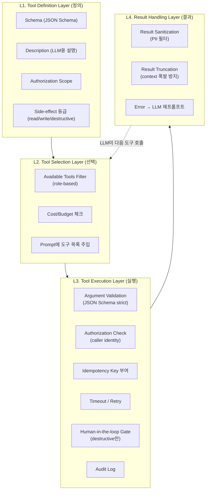
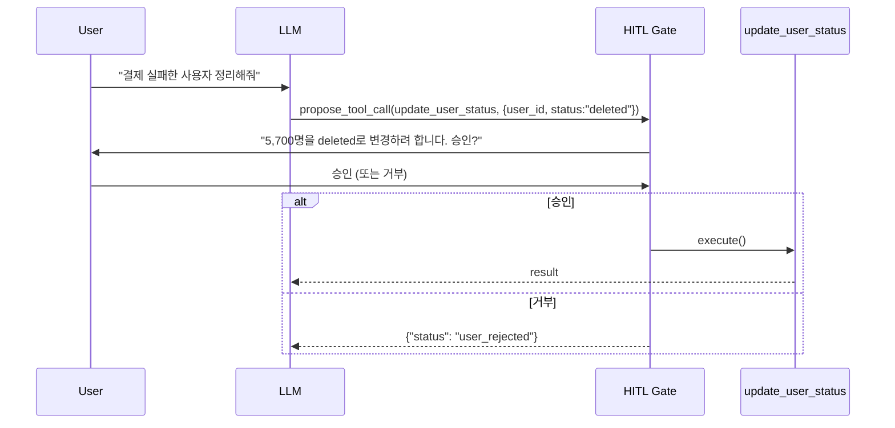

### Tool Use / Function Calling 안전 설계 — "LLM한테 DB 접근 권한 주면 알아서 잘하겠지"라는 순진함, 그리고 챗봇이 프로덕션에서 `UPDATE users SET status='deleted'`를 5,700행에 실행해 CS 전화가 4시간 동안 불통이 된 새벽

---

#### 0. 사건 재구성: "고객이 자기 계정 정보를 물어봤을 뿐인데"

2025년 10월, 국내 한 SaaS 회사. B2B 대시보드에 "AI 어시스턴트"를 붙였다. Function Calling 5개를 정의했다.

```json
[
  {"name": "get_user_info", "params": {"user_id": "string"}},
  {"name": "get_subscription", "params": {"user_id": "string"}},
  {"name": "update_user_status", "params": {"user_id": "string", "status": "string"}},
  {"name": "cancel_subscription", "params": {"user_id": "string"}},
  {"name": "send_notification", "params": {"user_id": "string", "message": "string"}}
]
```

관리자용 도구였기 때문에 `update_user_status`, `cancel_subscription`도 노출됐다. 화요일 새벽 2시 47분, 어드민 A씨가 챗봇에 이렇게 물었다.

> "지난주에 결제 실패한 사용자들 상태 좀 확인해줘. 만약 아직 결제 안 됐으면 알림 보내주고, 30일 넘은 애들은 정리하자."

LLM은 `list_users_with_failed_payment` 도구가 없다는 걸 깨닫고, **환각(hallucination)으로 SQL을 만들어내기 시작했다**. 정확히는, LLM이 `get_user_info`를 `user_id="ALL_FAILED_PAYMENT"`처럼 호출했고, 백엔드 개발자가 이걸 방어하지 않고 "혹시 몰라서" LIKE 검색으로 fallback을 뒀다. 결과적으로 5,700명이 매칭됐고, 이어서 LLM이 판단한 "정리하자" = `update_user_status(status="deleted")`가 **각 user_id에 대해 순차적으로 5,700번 호출**됐다.

호출당 200ms × 5,700 = 19분. 그동안 신규 로그인이 막혔고(로그인 시 status 체크), CS는 마비됐다.

원인은 3개였다.
1. **도구 권한 범위(Authorization Scope)를 도구 정의에 새겨넣지 않았다** — LLM 관점에서 `update_user_status`는 "그냥 쓸 수 있는 함수"였다.
2. **파괴적 작업(destructive action)에 human-in-the-loop 게이트가 없었다** — LLM이 결정하면 실행됐다.
3. **호출 예산(call budget)이 없었다** — 한 대화에서 update 계열 도구를 5,700번 호출하는 걸 아무도 안 막았다.

이건 프롬프트 잘 짜서 해결할 문제가 아니다. **아키텍처 문제**다.

---

#### 1. Tool Use 4계층 아키텍처

시니어가 Tool Use를 설계할 때, 이걸 "함수 하나 노출"로 보면 안 된다. **4계층**으로 쪼개야 한다.



**대부분의 팀은 L1과 L4만 만들고 L2/L3를 스킵한다.** 이게 사고의 원인이다.

---

#### 2. L1 — Tool Definition: "Side-effect 등급"이 없으면 안 된다

도구를 정의할 때 반드시 3등급으로 분류해야 한다.

| 등급 | 정의 | 예시 | 필요한 보호 |
|---|---|---|---|
| **read** | 상태 변경 없음 | `get_user_info`, `search_docs` | Rate limit만 |
| **write** | 되돌릴 수 있는 변경 | `create_ticket`, `add_note` | Idempotency key, Audit log |
| **destructive** | 되돌릴 수 없거나 비용이 큼 | `delete_user`, `send_email`, `charge_payment` | HITL Gate + 확인 프롬프트 + 승인자 서명 |

**핵심**: LLM은 "destructive" 등급을 프롬프트에서 알 필요가 없다. **런타임이 강제**해야 한다. 프롬프트에 "이 도구는 신중하게 써주세요"라고 써봤자 LLM은 결국 새벽 3시에 5,700번 호출한다.

```python
# 시니어 스타일 Tool 정의
@tool(
    side_effect="destructive",
    require_confirmation=True,
    max_calls_per_conversation=3,
    required_scopes=["admin.users.write"],
)
def update_user_status(user_id: str, status: Literal["active", "suspended", "deleted"]):
    ...
```

`@tool` 데코레이터가 LLM에 노출되는 스키마와 별개로 **런타임 정책**을 붙인다.

---

#### 3. L3 — Execution: Idempotency와 Human-in-the-loop

##### 3.1 Idempotency Key는 LLM이 아니라 프레임워크가 부여한다

LLM이 같은 도구를 두 번 호출하는 건 흔한 일이다. 특히 첫 번째 호출에서 timeout이 나면 LLM은 "실패했나?" 하고 재시도한다. 이때 **결제 API가 2번 실행**되면 끝이다.

```python
# 잘못된 접근
def charge_payment(user_id, amount):
    stripe.charge(user_id, amount)  # 재시도되면 2번 청구

# 시니어 접근
def charge_payment(user_id, amount, _idempotency_key=None):
    # 프레임워크가 (conversation_id, tool_name, args_hash)로 key 자동 생성
    if seen(_idempotency_key):
        return cached_result(_idempotency_key)
    result = stripe.charge(user_id, amount, idempotency_key=_idempotency_key)
    store(_idempotency_key, result)
    return result
```

**규칙**: Idempotency key는 `(conversation_id, tool_name, sha256(args))` 로 자동 생성. LLM에게 이 존재를 알릴 필요 없다.

##### 3.2 Human-in-the-loop Gate — "실행 전 승인"이 필요한 경우

destructive 도구는 **LLM이 호출을 결정한 뒤, 사용자가 명시적으로 승인**한 경우에만 실행돼야 한다.



**핵심 원칙**: 승인 UI는 LLM이 만들면 안 된다. **런타임이 도구의 side-effect 등급을 보고 자동으로 삽입**해야 한다. 프롬프트에 "실행 전 사용자에게 물어보세요"라고 써봤자, LLM은 그날 밤 컨텍스트가 넉넉하면 잊어버린다.

---

#### 4. Sequential vs Parallel Tool Calling — 시니어의 선택

Claude, GPT-4o 모두 **parallel tool calling**을 지원한다. 한 응답에 여러 도구 호출을 담을 수 있다. 이걸 쓸지 말지가 성능과 안전의 갈림길이다.

| 상황 | Sequential | Parallel |
|---|---|---|
| **read-only 조회 여러 개** | ❌ 느림 | ✅ 3~10배 빠름 |
| **write 도구** | ✅ 안전 | ❌ Race condition |
| **destructive 도구** | ✅ 필수 | ❌ 절대 금지 |
| **도구 간 의존성 있음** | ✅ 필요 | ❌ 잘못된 결과 |

```python
# 프레임워크가 강제해야 하는 정책
def can_parallelize(tools: list[ToolCall]) -> bool:
    if any(t.side_effect in ("write", "destructive") for t in tools):
        return False
    if has_dependency(tools):  # 한 도구의 output을 다른 도구가 참조
        return False
    return True
```

**실전 팁**: OpenAI/Anthropic 응답에서 parallel tool call이 들어와도, **정책에 안 맞으면 Sequential로 재정렬**해서 실행하라. LLM이 잘못 판단할 수 있다.

---

#### 5. 실제 사례

##### 사례 1: Anthropic Claude의 `bash` 도구 (Computer Use, 2024)

Claude Computer Use에서 `bash` 도구는 사실상 임의 코드 실행이다. Anthropic은 이걸 어떻게 설계했나?

- **컨테이너 격리** (Docker, no network by default)
- **파일시스템 스냅샷**으로 롤백 가능
- **명시적 확인 프롬프트**를 SDK 레벨에서 강제 (`--yolo` 플래그 없이는 각 명령 승인)
- **도구 정의에 "이 도구는 위험할 수 있음" 명시** — LLM이 신중해지도록 유도(부가적 방어)

핵심은 **"LLM이 안 위험한 짓을 하도록"이 아니라 "위험한 짓을 해도 피해가 격리되도록"**에 방어의 무게중심이 있다는 점이다.

##### 사례 2: Zapier의 `AI Actions` (2023–)

Zapier는 5,000개 이상의 앱 액션을 LLM에 노출한다. 그들의 설계 원칙:
- 모든 action은 **Zapier OAuth scope**를 사용자가 명시적으로 허용해야 함
- LLM이 호출을 결정해도, **preview 단계**에서 사용자가 필드 값을 확인
- **`draft` 모드**가 기본 — Gmail send를 요청해도 실제로는 임시저장함으로 감

시니어 관점: **"LLM에 도구를 준다"는 것과 "LLM에 실행 권한을 준다"는 것을 분리**한 게 핵심.

##### 사례 3: 국내 H 커머스 (2025) — Preview + Diff 패턴

"상품 가격을 조정해줘"라는 MD 요청에 LLM이 `update_product_price(product_id, price)`를 호출한다. 이 회사는 이걸 즉시 실행하지 않는다.

```
[LLM 제안]
- 상품 A: 12,000원 → 9,900원 (-17.5%)
- 상품 B: 8,900원 → 7,500원 (-15.7%)
- 상품 C: 15,000원 → 12,000원 (-20.0%)
- ...
[MD 승인 ✓] [수정] [취소]
```

Diff를 보여주고 **한 번의 승인으로 batch 실행**한다. Tool 호출 N번을 1번의 승인으로 묶는 건, 사용자 관점에서 UX 개선이지만 시스템 관점에서는 **audit log의 단위를 명확히** 하는 효과가 있다. 감사 대응 시 "누가 승인했는지"가 한 줄로 남는다.

##### 사례 4: 익명 스타트업 (2025) — MCP 서버로 도구 분리

내부 도구가 30개를 넘어가자 팀은 **MCP(Model Context Protocol) 서버**로 리팩토링했다. 각 도구가 독립 프로세스로 격리되고, 권한 정책이 MCP 서버 레벨에서 관리된다. 한 도구가 crash 나도 다른 도구는 살아남고, 새 도구를 추가할 때 LLM 애플리케이션 코드를 안 건드린다.

시니어 관점: **도구가 5개 넘어가면 MCP 같은 분리 레이어를 진지하게 고려**하라.

---

#### 6. 자주 놓치는 함정 6가지

##### 함정 1. Tool Description을 코드 주석처럼 씀

```python
# 나쁨
def get_user(user_id: str):
    """Gets a user."""
    ...

# 좋음
def get_user(user_id: str):
    """
    사용자의 프로필 정보를 조회합니다.
    - user_id는 정확한 UUID여야 합니다. 이메일이나 닉네임은 사용할 수 없습니다.
    - 존재하지 않는 사용자면 404를 반환합니다 (에러가 아닌 신호로 사용하세요).
    - 삭제된 사용자는 status='deleted'로 반환됩니다.
    """
```

Tool description은 **LLM용 문서**다. LLM은 이걸 읽고 도구 선택과 인자 구성을 결정한다. "무엇을 할지"만 쓰면 안 되고 "어떻게 잘못 쓰지 말지"를 써야 한다.

##### 함정 2. Error를 LLM에 raw로 던짐

```python
# 나쁨
except Exception as e:
    return {"error": str(e)}  # "psycopg2.errors.UniqueViolation: duplicate key value..."

# 좋음
except UniqueViolation:
    return {"error": "user_already_exists", "hint": "이 이메일로 이미 계정이 존재합니다. get_user를 먼저 호출하세요."}
```

LLM은 에러를 읽고 **다음 행동을 결정**한다. Stacktrace를 던지면 LLM이 혼란스러워하고, hint를 주면 자연스럽게 복구 경로로 간다.

##### 함정 3. Argument validation을 LLM에게 맡김

LLM은 JSON Schema를 "대충" 따른다. `user_id: string` 이라고 하면 `"ALL"`, `"*"`, `"[all failed users]"` 같은 걸 넣는다. **strict JSON Schema validation**을 도구 실행 전 무조건 통과해야 한다. 실패하면 실행하지 말고 에러 응답을 LLM에 돌려서 재시도시켜라.

##### 함정 4. Tool call loop 상한이 없음

LLM이 도구 호출 → 결과 → 도구 호출 → 결과를 무한 반복할 수 있다. `max_iterations=10` 같은 하드 리밋을 프레임워크에 걸어라. 넘으면 강제 종료하고 "복잡한 요청은 사람에게 에스컬레이션합니다" 응답을 낸다.

##### 함정 5. Tool result가 context를 폭파시킴

`search_docs(query)`가 500KB JSON을 반환하면 다음 LLM 호출에서 컨텍스트 예산이 끝난다. **결과 truncation과 요약을 프레임워크 레벨에서 자동화**하라. 예: 3KB 초과하면 자동으로 첫 10개 항목만 남기고 나머지는 "결과가 47개 더 있습니다. 세부 조회는 get_doc(id)를 쓰세요"로 대체.

##### 함정 6. Audit log에 argument를 안 남긴다

"LLM이 이 도구를 호출했다"만 남기고 argument를 안 남기면, 사고 조사 때 "왜 5,700명이 삭제됐는지" 재구성이 불가능하다. **conversation_id, tool_name, args_hash, timestamp, caller_identity**를 모두 남겨야 한다. PII가 걱정되면 args는 hash + redacted 버전으로.

---

#### 7. 언제 쓰고 언제 쓰면 안 되는가

##### ✅ 반드시 정식으로 설계해야 하는 경우
- **도구가 5개 이상**이고, 그중 하나라도 write/destructive면
- **여러 팀이 도구를 정의**하고 하나의 LLM 앱이 소비하는 구조
- **감사 대상 산업** (금융, 의료, 공공) — Audit log가 법적으로 필요
- **대량 처리 요청**을 받는 어드민 도구 — 5,700개 사고는 여기서 난다

##### ⚠️ 신중해야 하는 경우
- **PoC 단계** — L1~L4를 다 만들면 개발 속도가 느려진다. 대신 **write/destructive 도구를 아예 노출하지 말고 read-only로 시작**해라.
- **B2C 챗봇 with 개인정보** — Authorization Scope를 caller identity 기반으로 매번 검증. 세션 하이재킹 시나리오 방어 필요.

##### ❌ 쓰지 말아야 하는 경우 (혹은 쓰기 전에 다시 생각할 것)
- **LLM에 raw SQL 실행 도구를 주는 것** — 아무리 방어해도 결국 뚫린다. SQL이 필요하면 **미리 정의된 쿼리 템플릿**을 함수로 노출하라.
- **관리자 도구와 일반 사용자 도구를 같은 LLM 세션에서 다루는 것** — 프롬프트 인젝션으로 권한 경계가 쉽게 무너진다.
- **destructive 도구에 HITL Gate 없이 노출** — 예외 없다. 편의성이 위험을 이기지 못한다.

---

#### 8. 시니어의 체크리스트 (한 페이지로 요약)

| 항목 | 질문 |
|---|---|
| **Definition** | 모든 도구에 side-effect 등급이 있는가? |
| **Definition** | Description이 "쓰지 말아야 할 상황"까지 명시하는가? |
| **Selection** | Caller identity 기반으로 available tools가 필터링되는가? |
| **Execution** | Argument가 strict JSON Schema validation을 통과하는가? |
| **Execution** | Idempotency key가 프레임워크에서 자동 부여되는가? |
| **Execution** | Destructive 도구에 HITL Gate가 걸려 있는가? |
| **Execution** | 대화당 도구 호출 상한(`max_iterations`)이 있는가? |
| **Execution** | Parallel tool call이 write/destructive에서 자동으로 sequential로 재정렬되는가? |
| **Result** | Result가 3KB 넘으면 자동 truncation되는가? |
| **Result** | Error에 hint가 붙어 LLM이 복구 경로로 갈 수 있는가? |
| **Audit** | (conversation_id, tool, args_hash, caller)가 모두 로그되는가? |

이 11개 중 **7개 이상 "아니오"라면 프로덕션 배포 전에 멈춰라**. 사고는 시간문제다.

---

> 💡 **왜 중요한가**: LLM은 "설득하면 신중해지는 에이전트"가 아니라 "실행 권한을 준 만큼 실행하는 에이전트"다. 안전은 프롬프트가 아니라 런타임에서 강제해야 한다.
