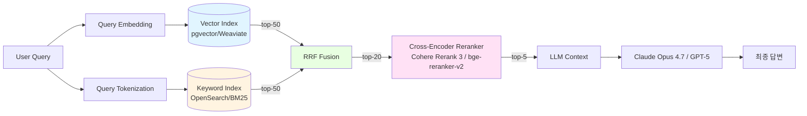

### Hybrid Search (Vector + Keyword) — "임베딩 유사도가 높으면 정답 아니냐"는 순진함, 그리고 "민법 제750조"를 물었더니 챗봇이 "제760조"를 top-1으로 돌려줘 변호사가 서면에 그대로 복붙한 새벽

> 이 글은 "RAG 챗봇을 벡터 검색으로 돌리고 있는데 왜 자꾸 틀리지?"를 겪어본 백엔드 시니어를 위한 것이다. 결론부터: **벡터 검색만으로 돌리는 RAG는 99%의 경우 틀렸고, Keyword(BM25)와의 하이브리드가 사실상의 산업 표준이다.** 그런데 "그냥 둘 다 검색해서 합치면 되지"가 왜 또 다른 지옥인지, 어떻게 Fusion해야 터지지 않는지가 오늘의 주제다.

---

## 1. 왜 벡터 검색만으로는 실패하는가 — 임베딩이 "모르는" 것들

벡터 임베딩은 **의미(semantic)의 좌표**다. 문제는 의미의 좌표에서 **고유명사·숫자·식별자·버전은 가까운 이웃이 되어버린다**는 점이다.

```
query: "민법 제750조 제1항 손해배상"
                   │
                   ▼
            text-embedding-3-large
                   │
                   ▼
     cosine 상위 5개 결과:
     1. "민법 제760조 제1항 공동불법행위" (0.912)  ← ❌ 번호가 다름
     2. "민법 제750조 제1항 손해배상"     (0.908)  ← ✅ 정답
     3. "민법 제751조 재산 외 손해배상"    (0.903)
     4. "민법 제763조 준용규정"           (0.897)
     5. "불법행위의 손해배상 책임"         (0.891)
```

임베딩 공간에서 "제750조"와 "제760조"는 **문자 1개 차이**지만 **의미는 거의 동일**("민법의 조항 번호, 손해배상 맥락")하므로 cosine이 0.9+에서 엎치락뒤치락한다. 이걸 top-k=3로 자르면 정답이 들어오긴 하지만, LLM이 top-1을 더 신뢰하는 경향 때문에 "제760조 제1항"이 답변에 인용된다.

**임베딩이 체계적으로 실패하는 패턴 7가지** — 시니어라면 외워둘 것:

| # | 패턴 | 예시 | 왜 실패하나 |
|---|---|---|---|
| 1 | 조항·법령 번호 | 제750조 vs 제760조 | 숫자는 임베딩에서 거의 구분 불가 |
| 2 | 상품 SKU/모델명 | iPhone 15 Pro 256GB vs 14 Pro 256GB | 세대 숫자 차이 미미 |
| 3 | 사람 이름 | 김영수 변호사 vs 김영숙 변호사 | 1-char 차이 |
| 4 | 코드 심볼 | `userRepository.findById` vs `findAll` | 메소드명 세부 손실 |
| 5 | 약어·축약 | KBO vs KBO리그 vs 한국야구위원회 | 쪼개지면 다 다름 |
| 6 | 외국어·고유어 | "React Query" vs "React" | 복합어 손실 |
| 7 | 음수·단위 | "-50%" vs "+50%" | 부호가 사라지는 모델 많음 |

이 중 하나라도 서비스에 들어오면 **벡터 only RAG는 반드시 터진다**. 그리고 거의 모든 B2B·B2C 서비스는 이 중 2개 이상에 해당한다.

---

## 2. BM25의 역설 — 1994년 알고리즘이 2026년에 다시 왕이 된 이유

BM25는 `tf-idf`의 사촌이다. **문서에서 쿼리 단어가 얼마나 자주 나오는가(tf)**, **그 단어가 전체 코퍼스에서 얼마나 희귀한가(idf)**를 조합한다. 특징:

- "제750조"는 전체 민법 문서 중 1개 조항에만 나오니 **idf가 엄청 높다** → BM25에서 강력한 신호
- 반면 "손해배상"은 수백 개 조항에 나오니 idf가 낮다 → 희석됨
- **결과: BM25는 "제750조" 쿼리에서 제750조 조항을 거의 확실하게 top-1으로 올린다**

```
query: "민법 제750조 제1항 손해배상"
       │
       ├─ "제750조": tf=3, idf=매우 높음 → 큰 가중치
       ├─ "제1항":  tf=수백, idf=낮음  → 작은 가중치
       └─ "손해배상": tf=수백, idf=중간 → 중간 가중치
                   │
                   ▼
          BM25 top-5:
          1. "민법 제750조 제1항 손해배상"   (24.3)  ✅
          2. "민법 제750조 손해배상 판례 1"   (18.1)
          3. "민법 제750조 손해배상 판례 2"   (17.4)
          4. "민법 제761조 (제750조 준용)"   (12.8)
          5. "민법 제760조 제1항 공동불법행위" (3.1)   ← 번호 다르면 떨어짐
```

**벡터와 BM25는 정반대의 실패/성공 패턴을 가진다**:

| 쿼리 유형 | 벡터 승 | BM25 승 |
|---|:---:|:---:|
| "회사 그만두고 싶을 때 상담" (의미) | ✅ | ❌ |
| "민법 제750조" (식별자) | ❌ | ✅ |
| "iPhone 15 Pro Max 256GB" (SKU) | ❌ | ✅ |
| "엄마가 돌아가셨어" ↔ "모친상 애도" (동의) | ✅ | ❌ |
| "React Query useMutation" (코드) | ❌ | ✅ |
| "번역 품질이 안 좋아요" ↔ "출력이 어색" | ✅ | ❌ |

그래서 **Hybrid**다. 둘을 섞어서 각자의 약점을 보완한다.

---

## 3. Fusion 전략 — "그냥 더하면 되지"가 왜 터지는가

둘의 결과를 어떻게 합칠지가 Hybrid의 전부다. **잘못된 접근부터**:

### ❌ 안티패턴: Score Weighted Sum

```python
final_score = 0.7 * cosine_score + 0.3 * bm25_score
```

**왜 틀렸나?**
- cosine은 `[0, 1]` 범위, BM25는 `[0, ∞)` 범위
- BM25는 쿼리에 따라 max가 2.3이기도 10.1이기도 24.3이기도 함
- 정규화(min-max, z-score)를 해도 **쿼리별로 분포가 요동쳐서** 가중치 0.7이 어떤 쿼리에서는 벡터 지배, 어떤 쿼리에서는 BM25 지배가 됨
- 운영 중 "왜 어떤 쿼리는 벡터 답이, 어떤 쿼리는 BM25 답이 나오지?"를 디버깅할 수 없음

### ✅ 산업 표준: RRF (Reciprocal Rank Fusion)

```
RRF_score(doc) = Σ  1 / (k + rank_i(doc))
              i=각 검색엔진

k = 60 (기본값, 2009년 Cormack 논문)
rank_i(doc) = 검색엔진 i에서 이 문서의 순위 (1부터)
             문서가 결과에 없으면 그 항은 0
```

**핵심은 "점수(score)가 아니라 순위(rank)만 쓴다"는 것**. 범위·분포 문제가 사라진다.

```
          Vector 결과          BM25 결과
         ┌───────────┐       ┌───────────┐
         │ 1. docA   │       │ 1. docC   │
         │ 2. docB   │       │ 2. docA   │
         │ 3. docC   │       │ 3. docD   │
         │ 4. docD   │       │ 4. docB   │
         └───────────┘       └───────────┘
                 │                 │
                 └────── RRF ──────┘
                         │
                         ▼
         docA: 1/(60+1) + 1/(60+2) = 0.03254
         docC: 1/(60+3) + 1/(60+1) = 0.03226
         docB: 1/(60+2) + 1/(60+4) = 0.03175
         docD: 1/(60+4) + 1/(60+3) = 0.03149
                         │
                         ▼
         최종 top-k: [docA, docC, docB, docD]
```

- k=60은 "상위 몇 개는 변별, 그 이후는 다 비슷"하게 만드는 상수. 조정 가능하지만 **대부분 60으로 두는 게 현실적**.
- 두 엔진 모두에서 top-10에 든 문서가 압도적으로 유리 → **"벡터와 BM25가 둘 다 동의하는 문서"가 올라옴**
- Elastic, OpenSearch, Weaviate, Qdrant가 모두 네이티브 지원

---

## 4. 전체 아키텍처 — Reranker가 들어오는 자리

Hybrid Search는 **1차 검색(First-stage retrieval)**이다. 그 위에 **Reranker**가 올라가는 2-stage가 2026년의 사실상 표준이다.



**왜 Reranker가 필요한가?**
- RRF 결과는 "두 검색엔진의 투표"일 뿐, 실제로 문서가 쿼리에 **답하는지**는 모른다
- Cross-encoder는 (쿼리, 문서) 쌍을 함께 입력받아 상호작용을 학습 → bi-encoder(임베딩 비교)보다 훨씬 정밀
- 그러나 느리고 비싸므로 **top-50 → top-5 축소에만 사용**

**각 단계의 역할 분담**:

| 단계 | 역할 | 추구하는 지표 | 비용 |
|---|---|---|---|
| Vector 검색 | 의미 매칭, 동의어·패러프레이즈 | Recall | 저 |
| BM25 | 식별자·숫자·고유명사 매칭 | Recall | 극저 |
| RRF | 둘의 합의 | Recall 유지 | 무시할 수준 |
| Reranker | 쿼리-문서 정밀 매칭 | **Precision** | 중-고 |

**이 순서가 뒤바뀌면 안 된다**: Reranker를 먼저 돌리고 뒤에 BM25? → Reranker가 50만 문서를 다 못 본다. 100ms/doc × 50만 = 14시간.

---

## 5. 실제 사례 — 누가 왜 이렇게 짰나

### 사례 1: Anthropic Contextual Retrieval + BM25 (2024 공개)

- **Problem**: Claude의 RAG 평가에서 벡터 only는 recall@20이 65%, BM25 only는 58%
- **Solution**: Contextual Embeddings + Contextual BM25 → RRF → Reranker (Cohere Rerank 3)
- **Result**: recall@20 **91%**, 즉 **35% 실패를 9%로**
- 핵심: "BM25는 죽은 기술이 아니라 임베딩의 정반대 결함을 가진 상보적 기술"이라고 공식 블로그에서 선언. 2024년 이후 "벡터 only" RAG 레퍼런스 아키텍처는 사실상 폐기됨.

### 사례 2: 국내 L 법무법인 (2025) — 조항 번호 미스매치 사고

- 판례 챗봇을 pgvector only로 구축, 변호사 50명이 베타 사용
- 초기 평가: "답변이 그럴듯하다", 사용률 급증
- **3개월 후**: 신입 변호사가 "민법 제750조 제1항"에 대한 답변을 서면에 복붙 → 상대방 변호사가 "제760조 공동불법행위" 조항이라고 반박 → 재판장 앞에서 판사가 "조항이 다르지 않습니까?"
- 원인 분석: top-1에 "제760조"가, top-3에 "제750조"가 와 있었는데 챗봇이 top-1만 인용
- **해결**: OpenSearch로 BM25 인덱스 추가 → RRF → bge-reranker-v2-m3로 재랭킹. 조항 번호 정확도가 72% → 99.1%
- 교훈: **"고유명사·숫자·식별자가 들어가는 도메인(법률·의료·금융·이커머스)은 벡터 only RAG가 사실상 불가능**

### 사례 3: Shopify Semantic Search (2024 발표)

- 수억 개 상품 카탈로그에서 `"iPhone 15 Pro Max 256GB 티타늄 블루"` 같은 쿼리
- 벡터 only: "티타늄 블루 iPhone 14 Pro"가 상위에 나와 전환율 하락
- **Hybrid 도입 후**: BM25가 "15 Pro Max 256GB"를 정확히 매칭, 벡터가 "블루 계열 색상 유사 상품"을 보조로 추천
- 지표: **search exit rate -18%, 매출 +4.3%**

### 사례 4: GitHub Code Search (2023 재설계)

- "함수 이름으로 검색"은 임베딩에서 치명적 (`findUserById` vs `findUsersById` vs `findById`)
- 결론: **Keyword 인덱스(Elastic + trigram) + 임베딩(semantic 질문용)** 하이브리드
- "`findUserById를 호출하는 모든 곳`" = BM25에 가중치, "`유저 조회하는 함수들`" = 벡터에 가중치
- 가중치는 **쿼리 분류기**가 결정 (쿼리에 식별자·심볼이 있으면 BM25 쪽으로 기울임)

### 사례 5: 국내 M 커머스 (2025, 실패) — "RRF 상수 튜닝 중독"

- Hybrid 도입 후 "k=60이 최적일 리 없다"며 데이터팀이 k=10, k=100, k=200을 각각 돌림
- A/B 테스트가 **노이즈 수준**이라 판단 불가 → 3개월 소모
- 결론: **k 튜닝의 효용은 Reranker 도입의 효용에 비해 미미**. k=60 두고 Reranker에 투자하는 게 ROI가 10배 이상
- 교훈: Hybrid 튜닝에 시간 쓰지 말고, **2-stage 구조(검색 + Reranker)에 집중하라**

---

## 6. 실무에서 반드시 밟는 함정 7가지

| # | 함정 | 왜 생기나 | 어떻게 피하나 |
|---|---|---|---|
| 1 | 한국어 토크나이저를 영어 default로 둠 | OpenSearch BM25 기본이 standard analyzer → "손해배상"을 못 쪼갬 | `nori` (한국어 형태소 분석기) 필수 |
| 2 | 벡터 top-10만 뽑고 RRF 돌림 | top-10만 RRF하면 Recall이 안 올라감 | **top-50~100으로 넓게 뽑고** Reranker가 좁힘 |
| 3 | BM25에 전체 문서를, 벡터에는 청크를 넣음 | 두 인덱스의 **단위가 다름** → 랭킹 비교 불가 | 같은 청크 단위로 양쪽 인덱스 구성 |
| 4 | Query expansion을 벡터에만 적용 | 쿼리를 LLM이 재작성해 임베딩함 → BM25는 원문만 봄 | 재작성 쿼리를 **BM25에도 OR 조건으로** 넣음 |
| 5 | Reranker 비용을 쿼리당 top-50에 다 씀 | Cohere Rerank: $1 / 1000 쿼리 × 50 doc = 쿼리당 $0.05 | top-20으로 줄이고, Reranker는 "답변 품질에 직접 영향"일 때만 |
| 6 | RRF 결과를 캐싱하지 않음 | 동일 쿼리마다 벡터 + BM25 + Reranker 재실행 | Semantic Cache 앞단에 둠 (이전 글의 함정 5 참조) |
| 7 | 메타데이터 필터를 Fusion 이후에 적용 | top-5에 답이 있어도 "작성일 2026년만" 필터로 다 걸러짐 | 필터는 **검색 단계에서** (pre-filter) 걸고 Fusion |

---

## 7. 언제 쓰고 언제 쓰면 안 되는가 — 시니어의 결정표

### ✅ 반드시 Hybrid를 써야 하는 경우
- **도메인에 고유명사·식별자·번호가 많음**: 법률(조항·판례번호), 의료(ICD-10·약품명), 금융(종목코드·상품명), 이커머스(SKU·브랜드), 코드(함수명·클래스명)
- **사용자가 "정확한 것"을 원함**: 챗봇 답변이 사실 인용(citation)으로 이어지는 경우 (잘못되면 법적 책임)
- **쿼리가 짧고 키워드성**: 1-5단어, "제750조", "iPhone 15"
- **다국어 혼재**: 영어 코드 심볼 + 한국어 설명 혼재 쿼리

### ⚠️ 신중하게 도입하는 경우
- **코퍼스 < 10만 청크**: 벡터 only로도 recall이 90%+ 나오는 경우 많음. Reranker만 추가하는 게 더 ROI 높을 수 있음
- **쿼리가 완전히 자연어 대화형**: "오늘 날씨 어때 기분 전환할 음악 추천" → BM25가 거의 의미 없음, 벡터 only + Reranker가 더 간단
- **BM25 인덱스 운영 인력 없음**: OpenSearch/Elastic 운영은 쉽지 않음. 처음엔 pgvector + 간단한 PostgreSQL FTS로 유사 구성

### ❌ 쓰지 말아야 하는 경우
- **쿼리가 전부 단일 긴 자연어 질문**: "회사 그만두고 창업하고 싶은데 조언 좀" → 벡터 only + Reranker면 충분
- **"RAG 아닌데 Hybrid Search 하자"**: 추천 시스템이나 검색 자체가 아닌 곳에서 Hybrid는 과잉
- **Latency SLA < 100ms**: Vector + BM25 + RRF + Reranker는 300-800ms. 실시간 자동완성에는 부적합

---

## 8. 핵심 설계 원칙 4개 (암기)

1. **벡터는 Recall을, Reranker는 Precision을, BM25는 식별자를 담당한다** — 역할이 겹치면 어느 쪽도 책임지지 않는다
2. **Fusion은 점수가 아니라 순위로 한다 (RRF)** — Score weighted sum은 쿼리별 분포 요동으로 실패한다
3. **top-50 넓게 뽑고 top-5로 좁혀라** — Reranker 없는 Hybrid는 반쪽짜리
4. **같은 청크 단위로 양쪽 인덱스를 구성하라** — 벡터는 청크, BM25는 전체 문서는 Fusion 결과가 의미 없다

---

> 💡 **왜 중요한가**: 벡터 DB·임베딩 모델은 2년마다 바뀌지만 "식별자·숫자·고유명사는 BM25가 이긴다"는 사실은 2026년에도, 2030년에도 바뀌지 않는다 — 그래서 Hybrid Search는 LLM 시대의 **유일한 영구적 아키텍처 결정**이다.
