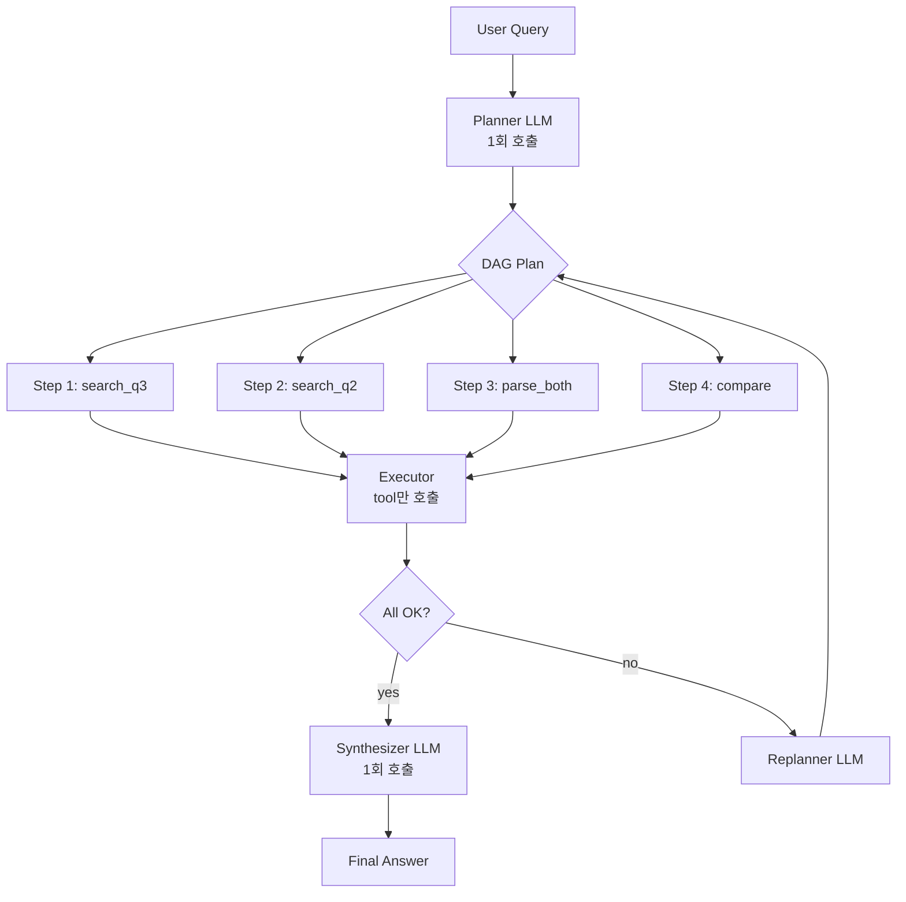

### ReAct vs Plan-and-Execute — "LLM이 알아서 다음 행동을 정하겠지"라는 순진함, 그리고 Research Agent가 23번째 턴에서 "검색을 다시 해볼까요?"로 돌아가며 주말 48시간을 태워 월요일 아침 $47,000 청구서로 CTO 책상에 올라간 새벽

이미 다룬 Multi-Agent Orchestration(Supervisor/Swarm/Hierarchical/Sequential)은 **여러 Agent를 어떻게 묶는가**의 문제였다. 오늘 다루는 ReAct와 Plan-and-Execute는 그 하위 레이어, **단일 Agent 안에서 "다음에 뭘 할지"를 어떻게 정하는가**의 문제다.

Supervisor가 "Research Agent야, 조사해줘"라고 지시했을 때, Research Agent 내부에서 돌아가는 루프가 바로 이것이다. 조직도를 아무리 잘 그려도, 각 사원의 사고방식이 ReAct냐 Plan-and-Execute냐에 따라 비용은 10배 차이가 나고 latency는 20배 차이가 난다.

---

#### 1. ReAct (Reason + Act) — "한 걸음 걷고, 다시 생각하기"

ReAct는 2022년 Yao et al.이 공식화한 패턴. 매 턴마다 세 가지를 반복한다.

1. **Thought** — "지금 뭘 해야 하지?"
2. **Action** — tool 호출 (search, DB query, fetch_url…)
3. **Observation** — tool 결과를 보고 다음 Thought로

```
┌──────────────────────────────────────────────────────┐
│  User: "Anthropic 2025년 Q3 매출을 Q2와 비교해줘"      │
└──────────────────┬───────────────────────────────────┘
                   ↓
    ┌─────────────────────────────────────┐
    │ Thought 1: 최신 분기 자료가 필요       │
    │ Action 1: web_search("Anthropic Q3")│ ← LLM 호출 ①
    │ Observation 1: [검색 결과 5건]        │
    └──────────────┬──────────────────────┘
                   ↓
    ┌─────────────────────────────────────┐
    │ Thought 2: 공식 IR 자료가 더 정확함    │ ← LLM 호출 ②
    │ Action 2: fetch_url(ir_pdf_url)     │
    │ Observation 2: [12페이지 PDF]        │
    └──────────────┬──────────────────────┘
                   ↓
    ┌─────────────────────────────────────┐
    │ Thought 3: Q2 자료도 필요             │ ← LLM 호출 ③
    │ Action 3: fetch_url(q2_pdf_url)     │
    └──────────────┬──────────────────────┘
                   ↓
            ... 반복 ... (매 턴 전체 context 재전송)
                   ↓
                Final Answer
```

**장점**: 피드백 루프가 짧다. "검색 결과가 비었네? 쿼리를 바꿔보자"가 자연스럽다.

**치명적 단점**: **매 턴마다 누적된 context 전체를 LLM에 다시 보낸다.** 10턴이면 LLM 호출 10회, 각 호출의 input 토큰은 선형으로 쌓인다. 23턴째에 "검색을 다시 해볼까요?"로 돌아가는 무한 루프에 빠지면 $47,000 청구서가 나온다(아래 사례 5).

---

#### 2. Plan-and-Execute — "먼저 지도를 그리고, 그 다음 걷기"

LangChain이 2023년 공식화한 패턴. 세 단계로 분리한다.

1. **Planner** (LLM 호출 1회) — 전체 작업을 subtask DAG로 쪼갠다
2. **Executor** (LLM 호출 없음) — 각 subtask의 tool 호출만 수행
3. **Replanner** (실패 시에만 LLM 호출) — 중간 실패하면 plan 수정



**장점**: LLM 추론 비용이 획기적으로 줄어든다. 10 step 작업에 ReAct는 LLM 10회, Plan-and-Execute는 LLM 2회(plan + synthesize). 또한 **plan을 사람이 사전 검토 가능**.

**치명적 단점**: Planner가 처음에 잘못 그린 지도는 Executor가 묵묵히 따라간다. "검색 결과가 비었는데도 다음 step으로 넘어간다"가 가장 흔한 사고 유형.

---

#### 3. 사례로 보는 선택의 결과

**사례 1: Anthropic Claude Code (2024–2026) — ReAct 선택**
코드 수정 Agent는 ReAct를 쓴다. 이유는 명확하다. "파일을 열어보니 예상과 다르게 생겼다"는 상황이 너무 자주 발생한다. 2번째 파일을 Read한 순간 1번째 파일에서 세운 수정 계획이 뒤집히는 게 일상이다. Plan을 미리 그려봤자 폐기된다.

**사례 2: Devin AI (Cognition Labs, 2024) — Hybrid 선택**
전체 작업은 Plan-and-Execute로 뼈대를 세운다. "저장소 구조 파악 → 테스트 실행 → 실패 분석 → 수정 → 재테스트"라는 상위 plan은 고정. 하지만 각 Step 내부는 ReAct로 돈다. "테스트 실행" 안에서 어떤 디렉터리로 cd할지는 매번 observation으로 결정. **레이어가 명확히 분리된 Hybrid**가 핵심.

**사례 3: Perplexity Pro Search (2024) — Plan-and-Execute 성공**
사용자 질문 "요즘 LLM 추론 비용 트렌드"를 받으면 Planner가 3~7개 서브쿼리로 먼저 쪼갠다: `[GPT-4o 가격, Claude 가격, Gemini 가격, 오픈소스 비용, 추론 최적화 기법]`. 각각을 **병렬로** 검색. 검색이 결정적이고 중간 pivot이 필요 없기 때문에 완벽히 들어맞는다. ReAct로 했다면 순차 처리 + 토큰 비용 폭발.

**사례 4: 국내 N 금융사 (2025) — Plan-and-Execute 실패**
대출 심사 Agent를 Plan-and-Execute로 구현. plan은 `[신용점수 조회 → DTI 계산 → 심사 규칙 적용 → 결과 통보]`. 문제는 "신용점수 조회" 단계에서 CB사 API가 timeout 나도 Executor는 **"신용점수 null"로 다음 step을 진행**했다. DTI 계산 로직이 null을 0으로 처리하면서 3일 동안 1,247건의 대출을 전부 "신용점수 미달"로 자동 거절. 사건 이후 각 step 뒤에 validation LLM 호출을 추가하면서 결국 ReAct와 비슷한 비용으로 수렴. "그럴 거면 처음부터 ReAct로 할 걸"이 포스트모템 결론.

**사례 5: 어느 YC 스타트업 $47,000 청구서 (2025, 익명 커뮤니티)**
Research → Code → Review 3-Agent 파이프라인. 각 Agent 내부가 ReAct였다. Review Agent가 "테스트 커버리지가 부족합니다"를 반환하면 Code Agent가 테스트 추가, Review Agent가 다시 "엣지 케이스가 부족합니다"를 반환하는 사이클이 금요일 밤부터 월요일 아침까지 48시간 돌았다. **종료 조건이 LLM 판단에만 있었던 것**이 근본 원인. GPT-4 호출 184만 회, 총 $47,281. 월요일 아침 Stripe 알림이 CTO를 깨웠다.

---

#### 4. 언제 ReAct를 써야 하는가

**반드시 ReAct**:
- 외부 환경이 예측 불가 (코드베이스 탐색, 디버깅, 웹 브라우징, 티켓 조사)
- Tool 응답의 품질이 들쭉날쭉해서 재시도/대체 전략이 필요
- **각 step이 다음 step의 action space를 바꾼다** (파일을 열어봐야 다음에 뭘 수정할지 안다)
- 작업의 성공 정의가 fuzzy해서 "충분한가"를 매 턴 평가해야 함

**ReAct 쓰면 안 되는 경우**:
- 작업이 결정적이고 workflow가 사실상 고정 (대출 심사, 월말 리포트 생성, ETL)
- Latency가 엄격 (매 턴 LLM 호출로 3~10초씩 쌓인다)
- Cost 예측 가능성이 비즈니스 요구사항 (SLA 계약, B2B 과금)

#### 5. 언제 Plan-and-Execute를 써야 하는가

**반드시 Plan-and-Execute**:
- 전체 workflow가 사전에 예측 가능 (데이터 파이프라인, 보고서 생성, 분기별 reconciliation)
- Subtask들이 병렬화 가능 (Perplexity Pro Search)
- 비싼 외부 호출을 포함 (DB migration, 결제 API) → **사람이 plan을 미리 승인해야 함**
- Cost/Latency 예측이 SLA 요구사항

**Plan-and-Execute 쓰면 안 되는 경우**:
- Observation으로 action space가 바뀌는 작업 (코딩, 디버깅)
- Planner LLM이 해당 도메인 지식 부족 (의료, 법률, 세무 — plan이 처음부터 잘못됨)
- Replan rate가 30% 넘으면 결국 ReAct와 비용이 같아진다

---

#### 6. 실무 함정

**함정 1. 종료 조건을 LLM 판단에만 맡긴다**
`is_done()`을 LLM에게 물으면 "조금 더 개선할 수 있을 것 같습니다"가 영원히 돌아온다. **반드시 세 가지 hard limit을 동시에** 걸어야 한다: `max_iterations=10`, `max_cost=$5`, `max_latency=60s`. 하나만 걸면 반드시 다른 쪽으로 터진다.

**함정 2. ReAct의 context를 매 턴 전부 재전송**
Observation이 10KB짜리 HTML이면 10턴째에 input token이 100KB가 된다. **반드시 observation summarization 레이어**를 끼워 넣거나, 3턴 이전의 observation은 LLM 요약으로 치환해야 한다. "LLM이 알아서 요약하겠지"는 Observation을 그대로 다 받은 다음에 요약하는 꼴이라 비용 절감 효과가 0.

**함정 3. Plan을 사람이 승인하지 않는다**
Plan-and-Execute의 **가장 큰 장점은 실행 전 plan 검토가 가능하다는 점**이다. 그런데 많은 팀이 plan을 자동으로 execute로 넘긴다. 비싼 작업(DB migration, 외부 결제 API, 대량 이메일 발송)이면 반드시 plan review step을 UI에 노출해야 한다. "plan만 보여주고 confirm 받기" 한 줄이 사고를 100% 막는다.

**함정 4. Replanner 비용을 계산에서 제외**
"Plan-and-Execute는 ReAct보다 10배 싸다"는 계산은 **replan이 안 일어난다는 가정 하에서만** 성립한다. 실측하면 replan rate가 평균 2~3회라서 ReAct와 비용이 수렴하는 경우가 많다. **반드시 production에서 `replan_count_per_task` 메트릭을 관측**해야 한다. 30% 넘으면 ReAct로 전환 검토.

**함정 5. Hybrid를 "둘 다 쓴다"로 오해**
Devin처럼 **상위 Plan + 하위 ReAct로 레이어를 분리**해야 한다. "쉬운 요청은 ReAct, 복잡한 요청은 Plan"처럼 조건 분기로 섞으면 어떤 코드 경로가 돌았는지 추적 불가능한 괴물이 된다. Hybrid는 "레이어 분리"지 "조건 분기"가 아니다.

**함정 6. Plan DAG를 LLM이 그대로 JSON으로 뱉게 한다**
LLM이 "step 3에서 step 1 결과를 참조"를 자연어로 쓰면 Executor가 파싱 못 한다. **Plan 출력은 반드시 structured output (JSON schema + validation)으로 강제**하고, step 간 의존성을 명시적으로 ID 참조로 받아야 한다. 안 그러면 Executor 구현의 50%가 LLM 자연어 파싱 코드가 된다.

---

#### 7. 결정 트리

```
Q: 작업의 중간 observation으로 다음 step이 바뀌는가?
├── Yes → ReAct
│         ⚠ max_iter + max_cost + max_latency 세 가지 모두 필수
│         ⚠ observation summarization 레이어 필수
└── No
    └── Q: Subtask들이 병렬화 가능한가?
        ├── Yes → Plan-and-Execute (Perplexity Pro Search 형태)
        └── No
            └── Q: 단일 작업 비용이 $1 이상 or 외부 쓰기 작업인가?
                ├── Yes → Plan-and-Execute + Human Plan Review
                └── No
                    └── Q: workflow가 정말 고정인가?
                        ├── Yes → Sequential Pipeline (Multi-Agent 패턴 D)
                        └── No  → Hybrid (상위 Plan + 하위 ReAct, Devin 형태)
```

> 💡 **왜 중요한가**: Multi-Agent 패턴이 조직도라면 ReAct/Plan-and-Execute는 각 사원의 사고방식이다 — 조직도만 바꿔서는 48시간 무한 루프와 $47,000 청구서가 해결되지 않는다.
