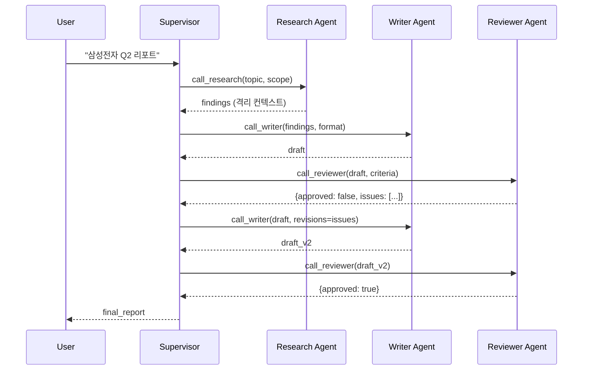

### Multi-Agent Orchestration — "Agent 하나에 다 시키면 되지"라는 순진함, 그리고 Research·Writer·Reviewer 3개 Agent가 "최종 결정은 누가 하냐"를 두고 서로에게 핑퐁하며 17턴을 돈 끝에 월요일 아침 투자 리포트 자리에 "I apologize for the confusion"만 42번 반복된 PDF가 올라가 PM이 "이거 ChatGPT 혼자 시키는 게 더 나았는데?"를 사내 회고에 적은 새벽

> 2026년 3분기, 국내 S 증권사. 리서치 자동화를 위해 **Research Agent → Writer Agent → Reviewer Agent → Publisher Agent** 4단 파이프라인을 깔았다. 각 Agent는 Claude Opus 4.6으로 동일. 처음엔 데모가 잘 됐다. "삼성전자 2026 Q2 실적 리포트 작성해줘" → 30초 만에 깔끔한 PDF. 그런데 베타 2주 차, 유독 **"반도체 사이클 전환점 분석"** 같은 애매한 주제가 들어오면 Writer가 Reviewer에게, Reviewer가 다시 Research로, Research가 다시 Writer에게 공을 넘기며 토큰을 태웠다. 어느 월요일 아침, 단일 리포트 하나에 **$1,840**이 찍혔고, 결과물은 "추가 분석이 필요합니다"로 끝나는 10페이지짜리 자기 변명문이었다. 원인은 코드 버그가 아니었다. **"최종 결정권"을 어느 Agent도 쥐지 못하도록 설계된 네트워크 토폴로지** 자체였다.

---

## 1. 왜 Single Agent로는 안 되는가 — 3가지 근본 한계

Single Agent에 Tool Use를 다 붙여도 충분해 보인다. ReAct 루프를 돌리면 되지 않나? 하지만 다음 3가지에서 깨진다.

### 한계 1. Context Pollution (컨텍스트 오염)
- 하나의 Agent가 "검색 결과 50건 + 사용자 요구사항 + 중간 산출물 + 자기 Reasoning + Tool 응답"을 모두 자기 컨텍스트에 쌓는다.
- 100K 컨텍스트도 20턴이면 넘친다. 넘치지 않아도 **Attention이 희석**되어 초반 지시사항을 잊는다 ("Lost in the Middle" 현상).
- 특히 **Research 중간 결과물**이 **최종 Instruction**을 밀어낸다.

### 한계 2. Role Confusion (역할 혼선)
- 같은 Agent가 "비판적 리뷰어" 역할과 "창의적 작성자" 역할을 번갈아 할 때, 뒤 역할이 앞 역할의 Persona를 오염시킨다.
- Reviewer 모드에서 발견한 오류를 Writer 모드에서 "자존심" 때문에 방어하는 현상(실측됨, Shanahan 2023).

### 한계 3. Parallelization 불가
- Single Agent는 본질적으로 Sequential. "경쟁사 3곳을 동시에 분석"하려 해도 결국 순차 처리.
- Latency와 Cost 모두 선형 증가.

**→ Multi-Agent는 "Divide and Conquer"가 아니라 "Context Isolation + Role Specialization + Parallelization"을 위한 아키텍처 결정이다.**

---

## 2. 4가지 Orchestration 토폴로지

```
┌──────────────────────────────────────────────────────────────────┐
│  (A) Hierarchical          (B) Sequential Pipeline               │
│                                                                  │
│      [Supervisor]              [A] → [B] → [C] → [D]             │
│       /    |    \                                                │
│     [W1] [W2] [W3]           - 고정 순서, 상태 전달              │
│                              - 단순, 디버깅 쉬움                 │
│    - Supervisor가 라우팅     - 분기/루프 어려움                  │
│    - Worker는 격리된 컨텍스트                                    │
│                                                                  │
├──────────────────────────────────────────────────────────────────┤
│  (C) Parallel Fan-out/In   (D) Network (Peer-to-Peer)            │
│                                                                  │
│         [Coordinator]            [A] ⇄ [B]                       │
│          /    |    \              ⇅     ⇅                        │
│       [W1]  [W2]  [W3]           [D] ⇄ [C]                       │
│          \    |    /                                             │
│         [Aggregator]         - 모든 Agent가 서로 호출 가능       │
│                              - 유연, 통제 불가능                 │
│    - 병렬 실행 후 통합       - "누가 결정?" 문제가 터지는 곳     │
│    - Map-Reduce 패턴         - AutoGen 초기 설계의 함정          │
└──────────────────────────────────────────────────────────────────┘
```

### 트레이드오프 매트릭스

| 패턴 | 통제성 | 유연성 | Latency | Cost 예측성 | 디버깅 | 적합한 Task |
|------|--------|--------|---------|-------------|--------|-------------|
| Hierarchical | ★★★★★ | ★★★ | 중 | ★★★★ | ★★★★ | 복잡 분기, 품질 중시 |
| Sequential | ★★★★★ | ★ | 선형 증가 | ★★★★★ | ★★★★★ | ETL형, 결정론적 |
| Parallel Fan-out | ★★★★ | ★★★ | 짧음 (max) | ★★★ | ★★★ | 비교·검색·집계 |
| Network | ★ | ★★★★★ | 폭발 | ★ | ★ | 연구·실험 |

**→ 프로덕션은 사실상 Hierarchical 또는 Sequential 둘 중 하나다.** Network는 데모와 논문에서 멋있어 보일 뿐, 실전에서는 S 증권사 사례처럼 터진다.

---

## 3. Supervisor Pattern의 실제 구현 — "라우팅 + 종료 조건"

Hierarchical의 핵심은 **Supervisor Agent가 Worker를 호출하는 Tool Call로 추상화**된다는 점이다.



**중요한 설계 결정 4가지:**

### ① Worker는 Supervisor의 Tool이지, 대등한 참여자가 아니다
- Worker Agent에게 Supervisor를 호출할 권한을 주면 즉시 Network 토폴로지로 타락한다.
- Worker는 자기 Task만 수행하고 **구조화된 응답**을 반환해야 한다. 자연어로 "다음에 뭘 해야 할까요?"를 반환하는 순간 S 증권사가 된다.

### ② 종료 조건은 Supervisor의 책임
- Max iteration (예: 리뷰 루프 3회), Cost budget (예: $5/request), Deadline (예: 60초) 중 하나를 **반드시 코드로 enforce**.
- LLM이 "충분합니다"라고 판단하길 기대하면 안 된다. 그 판단은 비싸고 틀린다.

### ③ Worker 컨텍스트는 격리된다
- Writer가 Research의 Reasoning까지 다 보면 Context Pollution 재발.
- Worker에게는 **Task 명세 + 필요한 입력만** 넘긴다. "왜 이걸 하는지"는 Supervisor가 이미 결정했으므로 알 필요 없음.

### ④ Supervisor 자체는 가볍게
- Supervisor가 추론을 많이 하면 그 자신이 Single Agent의 한계에 부딪힌다.
- Supervisor는 "다음에 누구를 부를지" 결정하는 **얇은 Router**여야 한다. 복잡한 추론은 Worker에 위임.

---

## 4. State 관리 — Message Passing vs Shared State

Multi-Agent에서 두 번째로 흔한 사고 지점. 두 가지 모델 중 하나를 명시적으로 선택해야 한다.

### Message Passing (AutoGen 초기 방식)
- Agent 간 대화 로그를 모든 Agent가 공유.
- **문제**: 대화가 길어지면 모든 Agent의 컨텍스트가 함께 폭발. 10턴 넘어가면 비용이 선형이 아니라 제곱으로 는다 (각 턴마다 모든 이전 턴을 다시 읽음).

### Shared State (LangGraph 방식)
- 공유 State 객체를 각 Agent가 읽고 쓴다.
- Agent 호출 시 **필요한 State 필드만** 추출해서 전달.
- **문제**: State 스키마를 사전에 설계해야 함. "어떤 필드가 있을지" 모르는 탐색형 Task에 부적합.

```python
# LangGraph 스타일 shared state 예시
class ReportState(TypedDict):
    topic: str
    research_findings: list[str]      # Research Agent만 write
    draft: str                        # Writer Agent만 write
    review_issues: list[str]          # Reviewer Agent만 write
    iteration: int                    # Supervisor가 관리
    final_report: str | None
```

**시니어의 선택**: 프로덕션 Hierarchical에서는 **Shared State + 명시적 Write Permission**. "누가 어떤 필드를 쓸 수 있는가"를 코드로 enforce하면 LLM의 Hallucination이 상태를 오염시키지 못한다.

---

## 5. 실제 사례

### 사례 1: Anthropic Claude Code 자체 (2024–2026)
- 당신이 지금 쓰고 있는 Claude Code가 **Hierarchical Multi-Agent**다. Main Agent (오케스트레이터) + Sub-agents (Explore, Plan, general-purpose, codex-rescue 등).
- Sub-agent는 **독립 컨텍스트**로 호출되고, 결과만 자연어로 반환. Main Agent는 Sub-agent의 중간 Reasoning을 보지 못한다.
- 교훈: 컨텍스트 격리는 "비효율"이 아니라 **품질 유지의 핵심**. Explore agent가 50개 파일을 뒤져도 Main Agent 컨텍스트에는 요약만 들어온다.

### 사례 2: Cognition Devin (2024) — Network 토폴로지의 교훈
- 초기 Devin 데모는 "자율 AI 소프트웨어 엔지니어"로 센세이션. 내부는 Planner + Coder + Tester + Browser Agent가 자유롭게 호출.
- 현장 배포 후 발견된 문제: **Agent 간 "책임 전가"**. Tester가 실패하면 Coder에게 넘기고, Coder는 "요구사항이 모호하다"며 Planner에게 넘기고, Planner는 다시 Browser에게 "더 조사해봐"를 반복.
- Cognition은 2024 하반기에 **Supervisor 중심의 Hierarchical로 재설계**. 공개 포스트에서 "완전 자율 Multi-Agent는 아직 시기상조"라고 명시적으로 인정.

### 사례 3: GitHub Copilot Workspace (2024)
- Spec Agent → Plan Agent → Implementation Agent → Validation Agent의 **엄격한 Sequential Pipeline**.
- 각 단계는 사용자 승인 체크포인트를 둠. "Agent가 알아서"가 아니라 **"Agent + Human-in-the-loop"** 하이브리드.
- 교훈: 중요한 결정은 Agent 간 핑퐁이 아니라 **사람에게 올려야 한다**. "자율성"은 비용이지, 가치가 아니다.

### 사례 4: 국내 K 증권사 (2026) — 리서치 자동화 2차 시도
- 1차는 서두의 S 증권사와 유사한 Network 설계 → 실패.
- 2차는 **단일 Supervisor + 격리된 Worker + Max Iteration 2 + $3 Budget cap**. 품질은 수용 가능 수준으로 올라오고 비용은 1차의 1/40.
- 핵심 변화: **"Agent에게 자율성을 주는 것"을 포기**. 라우팅 로직을 Supervisor 프롬프트에 결정 테이블로 명시.

### 사례 5: Microsoft AutoGen → Magentic-One (2024)
- AutoGen 1.0의 "GroupChat"은 Network 토폴로지. 2024년 Magentic-One으로 재설계하며 **Orchestrator-Worker 아키텍처**로 전환.
- Microsoft Research 블로그: "Fully decentralized multi-agent systems have shown limited reliability in production tasks."
- 학계도 Network의 낭만을 포기하는 중.

### 사례 6 (실패): 국내 B 로펌 (2025) — "변호사 Agent 7인방"
- 민사 Agent, 형사 Agent, 세무 Agent, 노동 Agent, 지재권 Agent, 가사 Agent + Senior Partner Agent 7개를 네트워크로 연결.
- 복잡 사건이 들어오면 Agent들이 "제 전문 분야가 아닙니다"를 돌아가며 발화. 평균 턴 수 12, 평균 비용 $8/사건, 평균 응답 시간 94초.
- 재설계: Senior Partner Agent 하나가 Sub-expert agent를 Tool로 호출. 턴 수 평균 3, 비용 $1.2, 시간 22초. **"회의"가 사라지자 답이 나왔다.**

---

## 6. 함정 6가지

### 함정 1. Agent 수가 많을수록 똑똑해질 것이라는 환상
- 2개로 되는 걸 5개로 쪼개면 **품질이 아니라 레이턴시와 비용이 3배**가 된다.
- "Specialist Agent"가 많아지면 Supervisor의 라우팅 결정 공간이 폭발 → Supervisor 자체가 틀린다.
- **룰: Agent는 3개 이하로 시작하고, 데이터로 추가를 정당화할 때만 늘린다.**

### 함정 2. Worker에게 "다음에 뭘 할까"를 묻는다
- Worker 응답에 `"next_action": "..."` 같은 필드를 두면, Supervisor가 그걸 신뢰하기 시작하고 → 사실상 Network가 됨.
- Worker는 **자기 결과물과 상태 플래그(완료/실패/부분완료)만** 반환해야 한다.

### 함정 3. Agent 간 통신에 자연어를 쓴다
- Agent A: "그 부분은 조금 애매하긴 한데 대체로 괜찮아 보입니다."
- Agent B: 이걸 파싱해서 "통과"로 해석할지 "재검토"로 해석할지 LLM이 결정 → 비결정론.
- **구조화된 JSON Schema**로 통신. Pydantic이든 Zod든 강제.

### 함정 4. 무한 루프 방지가 없다
- Reviewer → Writer → Reviewer → Writer... 가 멈추지 않는 시나리오를 반드시 시뮬레이션.
- 코드에 `max_iterations`, `total_cost_budget`, `wall_clock_deadline` **세 가지 전부** enforce. 하나로는 부족하다.

### 함정 5. Observability가 Agent별로 안 된다
- 하나의 "Request"에 Agent 5개가 각각 LLM을 3번씩 부르면 **15개 span**이 생긴다.
- Trace가 Agent boundary에서 끊기면 "어느 Agent가 비용을 태웠는지" 못 찾는다.
- LangSmith/Langfuse의 **Nested Trace** 기능 필수. Agent 이름을 span attribute로 반드시 태그.

### 함정 6. Agent 역할을 사람 조직도처럼 만든다
- "PM Agent", "Dev Agent", "QA Agent", "DevOps Agent" — 인간 조직을 그대로 Agent화.
- **인간 조직은 비효율을 전제로 설계된 구조**다 (책임 분산, 견제, 승진 경로…). LLM에 복사하면 그 비효율만 상속한다.
- Agent 분리 기준은 "역할"이 아니라 **"컨텍스트 격리가 필요한가"**와 **"병렬 실행이 가치가 있는가"**.

---

## 7. 언제 쓰고 언제 쓰면 안 되는가

### ✅ 반드시 Multi-Agent로 가야 하는 경우
1. **병렬 비교/집계가 핵심인 Task**: "경쟁사 10곳 분석 → 통합 리포트" — Fan-out/Fan-in이 Latency를 10배 줄인다.
2. **컨텍스트가 100K를 넘는 Task**: Research 중간 산출물이 수만 토큰이고 최종 응답에는 요약만 필요한 경우.
3. **역할별 Persona가 결과 품질을 결정하는 Task**: Red Team / Blue Team 시뮬레이션, 적대적 리뷰.
4. **외부 시스템 통합이 Agent별로 완전히 다른 경우**: DB Agent, Search Agent, Email Agent — Tool set이 겹치지 않을 때.

### ⚠️ 신중해야 하는 경우
- **Latency 민감 (p99 < 2초) 서비스**: Supervisor 1 LLM 호출 + Worker 1 LLM 호출만 해도 왕복 2회. 챗봇 UX에는 부담.
- **Cost 민감 B2C**: Agent 수만큼 LLM 호출이 곱해진다. 사용자당 월 $0.05 목표인 서비스에는 과함.
- **결정론이 중요한 Task**: 재무, 법무 — Agent 간 핑퐁은 재현 불가능. Workflow Engine + Single LLM이 낫다.

### ❌ 쓰면 안 되는 경우
- **"Agent 쓰면 멋있어 보여서"**: 시니어 면접에서 가장 자주 노출되는 안티패턴.
- **Single Agent + ReAct로 10턴 안에 끝나는 Task**: 오버엔지니어링.
- **Agent 간 책임 경계가 모호한 Task**: "창의성 Agent"와 "비판 Agent"처럼 역할이 겹치는 설계 → Network 토폴로지의 함정.
- **Workflow Engine(Temporal, Airflow)으로 충분한 결정론적 파이프라인**: LLM은 비싸고 비결정론적이다. Agent화는 비용이지 혜택이 아니다.

---

## 8. 시니어의 기본 설계 체크리스트

```
□ 토폴로지는 Hierarchical 또는 Sequential인가? (Network 금지)
□ Supervisor는 "얇은 Router"인가? (복잡 추론 금지)
□ Worker 응답은 structured output인가? (자연어 금지)
□ Worker에게 Supervisor 호출 권한을 주지 않았는가?
□ max_iterations, cost_budget, deadline 셋 다 코드로 enforce되는가?
□ Shared State의 write 권한이 Agent별로 분리되어 있는가?
□ Agent별 span이 Trace에 nested로 기록되는가?
□ Agent 수는 3개 이하로 시작하는가? (추가는 데이터로 정당화)
□ Human-in-the-loop 체크포인트가 필요한 지점에 있는가?
```

---

> 💡 **왜 중요한가**: Multi-Agent는 "Agent를 많이 쓰면 똑똑해진다"가 아니라 **"컨텍스트 격리·역할 분리·병렬화를 아키텍처로 강제한다"**는 결정이고, 이 결정을 Network 토폴로지로 흐리는 순간 Agent들은 회의만 하다 월요일 아침 CTO 메일함을 폭파시킨다.
