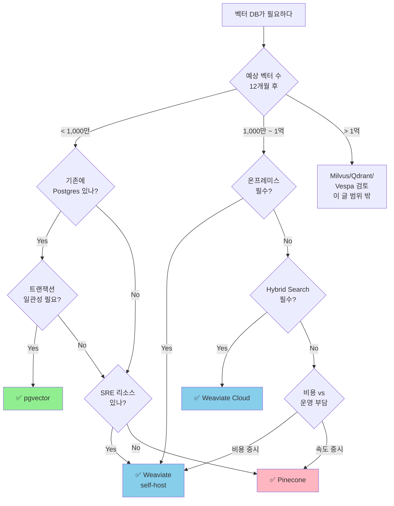

### Vector DB 선택 — "Pinecone이 업계 표준이라던데"라는 순진함, 그리고 월 $800이던 벡터 검색 비용이 1,200만 벡터를 돌파하는 순간 $12,400로 15배 폭증해 CFO가 "AI 프로젝트 전면 중단"을 임원회의 안건으로 올린 새벽

2026년 2월. 국내 C 커머스의 상품 검색 AI팀은 Pinecone Starter($70/월)로 PoC를 시작했다. 임베딩 50만 개, p99 42ms, "완벽하다." 2026년 7월 상품 카탈로그가 1,200만 개로 확장되는 순간, Pinecone 청구서는 월 $12,400이 찍혔다. 같은 트래픽, 같은 쿼리, 같은 SLA. 벡터 수만 늘었을 뿐이다.

팀장은 "pgvector로 옮기자"고 결정했다. 2주 후 롤백했다. 1,200만 벡터에 HNSW 인덱스를 빌드하는 데 11시간이 걸렸고, 그 시간 동안 PostgreSQL primary의 CPU가 96%로 고정되어 주문 트랜잭션 레이턴시가 3배로 튀었다. "Vector DB는 분리하자"로 결론이 났고, 다시 Weaviate self-host로 갔다. 그런데 이번엔 운영팀이 "쿠버네티스 StatefulSet 벡터 샤드 리밸런싱" 룬북을 만드느라 Agent 프로덕트 배포를 3주 지연했다.

CTO가 묻는다. **"처음부터 다시 판단한다면, 뭘 썼어야 했어?"** 이 질문에 "상황마다 다르다"고만 답하면 PoC → 프로덕션 전환 때마다 똑같은 비용을 반복해 지불한다.

---

#### 세 선택지의 본질적 차이 — "ANN 라이브러리를 어디까지 서비스로 감쌌는가"

```
┌────────────────────────────────────────────────────────────────────┐
│                      본질은 모두 같은 ANN 알고리즘                 │
│                   (HNSW / IVF-PQ / DiskANN / ScaNN)                │
└────────────────────────────────────────────────────────────────────┘
                                 │
          ┌──────────────────────┼──────────────────────┐
          ▼                      ▼                      ▼
   ┌─────────────┐        ┌─────────────┐        ┌─────────────┐
   │   Pinecone  │        │   Weaviate  │        │  pgvector   │
   │ (Managed)   │        │ (Self-host  │        │ (Postgres   │
   │             │        │  or Cloud)  │        │  Extension) │
   ├─────────────┤        ├─────────────┤        ├─────────────┤
   │ 추상화 레벨  │        │ 추상화 레벨 │        │ 추상화 레벨  │
   │  = SaaS     │        │  = PaaS     │        │  = Library  │
   │             │        │             │        │             │
   │ 운영 책임:   │        │ 운영 책임:  │        │ 운영 책임:   │
   │   벤더      │        │   팀 + 벤더 │        │   전부 팀    │
   │             │        │             │        │             │
   │ 요금 모델:   │        │ 요금 모델:  │        │ 요금 모델:   │
   │ vector-pod  │        │  CPU/RAM    │        │ RDS 인스턴스 │
   │ (벡터 수 ↑) │        │ (워크로드)  │        │ (DB 크기)    │
   │             │        │             │        │             │
   │ 트랜잭션:   │        │ 트랜잭션:   │        │ 트랜잭션:    │
   │   ✗ 없음    │        │   ✗ 없음    │        │   ✅ ACID    │
   │             │        │             │        │             │
   │ 동적 샤딩:  │        │ 동적 샤딩:  │        │ 동적 샤딩:   │
   │   ✅ 자동   │        │   수동 운영 │        │   ✗ (수동)  │
   └─────────────┘        └─────────────┘        └─────────────┘
```

세 제품을 "성능 벤치마크"로 비교하는 글이 넘쳐나지만, 시니어가 봐야 할 축은 성능이 아니라 **"운영 책임의 경계선이 어디에 그어져 있는가"** 다. ANN 알고리즘 자체는 다 비슷하다. 결정적 차이는 "누가 리밸런싱을 하고, 누가 요금 청구서에 서명하고, 누가 트랜잭션 일관성을 보장하는가"다.

---

#### Pinecone — "SaaS는 100만 벡터까진 천국, 1,000만부터 지옥"

**설계 철학**: 벡터 검색을 완전히 추상화해서, 개발자는 `upsert()` / `query()` 두 메서드만 안다.

```python
import pinecone
pinecone.init(api_key="...", environment="us-east-1")
index = pinecone.Index("products")

index.upsert(vectors=[("id1", [0.1, 0.2, ...], {"category": "shoes"})])
results = index.query(vector=[0.1, 0.2, ...], top_k=10, filter={"category": "shoes"})
```

**숨은 요금 구조 (2025년 가격표 기준)**:
- **Serverless**: 벡터 저장 $0.33/GB·월 + 쿼리 $8.25/백만 request + write $4/백만
- **Pod-based (Starter 외)**: p1.x1 pod 하나당 $70/월, 벡터 500만 개까지. 1,200만 벡터 → **최소 pod 3개 + replica 2개 = $420 → 네임스페이스 분리/고가용성 가면 $12k 금방**

**트레이드오프**:

| 축 | 평가 |
|---|---|
| 초기 속도 | 🟢 PoC 하루면 끝남 |
| 운영 부담 | 🟢 거의 0 — SRE 리소스 투입 불필요 |
| 비용 예측성 | 🔴 **벡터 수에 비선형** — 10배 성장 시 15–30배 폭증 |
| 데이터 주권 | 🔴 AWS/GCP 특정 리전 외 선택지 좁음 — **금융권/공공은 즉시 탈락** |
| 트랜잭션 일관성 | 🔴 없음 — "상품 DELETE → 벡터 삭제" 사이 lag 수 초 발생 |
| Vendor Lock-in | 🔴 쿼리 DSL, 메타데이터 필터 문법이 Pinecone 전용 |

**실제 사례 1: Notion AI (2023 공개 → 2024 이전 발표)**
초기 Notion AI는 Pinecone 위에 전체 워크스페이스 임베딩을 올렸다. 사용자 수가 폭증하자 "namespace per workspace" 전략으로 수십만 개의 네임스페이스를 운영하다가 **메타데이터 필터 성능이 급락**해 2024년 자체 벡터 인프라(Turbopuffer 사용)로 이전. 교훈: **"multi-tenancy를 Pinecone에 맡기면 특정 임계값에서 지불이 아니라 아키텍처가 깨진다."**

**실제 사례 2: Perplexity (2024 tech talk)**
웹 스케일 검색 인덱스를 Pinecone에 올렸다가 "읽기 부하 대비 비용"이 OpenSearch + 자체 HNSW 조합의 4.7배로 측정되어 하이브리드로 전환. 교훈: **read-heavy 워크로드일수록 Pinecone의 pod 모델이 불리하다.**

✅ **반드시 Pinecone을 써야 하는 경우**
- 벡터 수가 **1,000만 미만**에서 안정, 성장이 선형이거나 완만할 때
- 팀에 SRE/인프라 담당자가 **없거나 Vector DB에 쓸 여력이 없을 때**
- "출시까지 2주"처럼 time-to-market이 비용을 압도할 때
- RAG prototyping, 사내 지식 챗봇 등 **MVP 성격**

❌ **쓰면 안 되는 경우**
- 벡터가 **분기당 2배 이상 성장** 중 — 요금 곡선이 위험
- **금융/의료/공공** — 데이터 주권, 감사 요건 불만족
- 트랜잭션 일관성이 필요 (상품 삭제 즉시 추천에서 사라져야 하는 커머스)
- 쿼리당 **메타데이터 필터가 3개 이상** — Pinecone 메타필터는 cardinality 높아지면 급격히 느려짐

---

#### Weaviate — "오픈소스의 자유, 그 자유가 만든 운영 룬북 47페이지"

**설계 철학**: 벡터 + 객체 저장소를 하나의 "schema 있는 DB"로 통합. GraphQL 쿼리, 모듈러 임베더(OpenAI/Cohere/Transformers), hybrid search(BM25+vector) 내장.

```python
client.query.get("Product", ["title", "category"]) \
  .with_hybrid(query="런닝화", alpha=0.7) \
  .with_where({"path": ["stock"], "operator": "GreaterThan", "valueInt": 0}) \
  .with_limit(10).do()
```

**아키텍처의 결정적 특징**: **Hybrid Search와 메타데이터 필터가 1급 시민**이다. Pinecone이 "벡터 저장소에 메타필터를 부가 기능으로 붙인" 반면, Weaviate는 처음부터 schema-first로 설계되어 BM25와 vector를 RRF로 합치는 게 자연스럽다.

**운영의 현실**:

```
┌─────────────────────────────────────────────────────────┐
│   Weaviate StatefulSet (쿠버네티스)                     │
├─────────────────────────────────────────────────────────┤
│   Shard 0 (PV 500Gi) ← HNSW 인덱스 + 객체 저장소        │
│   Shard 1 (PV 500Gi) ← ...                              │
│   Shard 2 (PV 500Gi) ← ...                              │
│                                                         │
│   운영팀이 책임질 것:                                   │
│   • Shard 리밸런싱 (벡터 수 2배 성장 시 수동 재분배)    │
│   • HNSW 인덱스 빌드 중 RAM 2–3배 피크 처리            │
│   • Backup (Raft 기반 분산 스냅샷)                      │
│   • Rolling upgrade 중 쿼리 라우팅 drift 방지           │
│   • 모듈러 임베더(text2vec-openai)의 rate limit 관리    │
└─────────────────────────────────────────────────────────┘
```

**트레이드오프**:

| 축 | 평가 |
|---|---|
| 기능 풍부도 | 🟢 Hybrid, Multi-tenancy, Named vectors 모두 1급 |
| 비용 (대규모) | 🟢 CPU/RAM만 지불 — 벡터 수 늘어도 선형 |
| 운영 복잡도 | 🔴 **SRE 1인 full-time 필수** (self-host 시) |
| Weaviate Cloud | 🟡 관리형 있음, 하지만 Pinecone 대비 가격 메리트 작음 |
| 트랜잭션 | 🔴 없음 — eventually consistent |
| 커뮤니티 | 🟢 활발, 하지만 breaking change 잦음 (v1.24 → v1.25 schema 호환성 깨짐 사례) |

**실제 사례 3: Stack Overflow (2024 발표)**
"Stack Exchange for Teams" 검색을 Weaviate self-host로 운영. 결정 이유: **"답변 본문 + 코드 블록 + 태그를 BM25와 vector로 동시에 검색해야 했고, Pinecone으로는 메타필터 cardinality 때문에 조각내 쿼리해야 했다."** 다만 운영을 위해 **plat eng팀 2명 투입**을 명시.

**실제 사례 4: 국내 N 금융사 (2025, 사내 지식 챗봇)**
금감원 감사 요건으로 **온프레미스 필수** → Pinecone 즉시 탈락. Weaviate self-host 선택. 운영 6개월차에 "Shard 리밸런싱" 룬북만 47페이지, 그중 15페이지가 "upgrade 중 index corruption 복구". 교훈: **"오픈소스 벡터 DB는 라이선스가 공짜지 운영이 공짜가 아니다."**

✅ **반드시 Weaviate를 써야 하는 경우**
- 벡터 **1,000만~1억**, 성장 중, 비용 통제가 중요
- Hybrid Search가 **필수** (법률/의료/코드 검색 — 키워드 정확도 포기 못함)
- **온프레미스 요건** 또는 특정 리전/VPC 필수
- 벡터 외에 **구조화된 메타데이터 쿼리**가 많음 (multi-tenancy, 복잡한 필터)

❌ **쓰면 안 되는 경우**
- 팀에 쿠버네티스 StatefulSet 운영 경험이 **없을 때** (Weaviate Cloud로 가야 함)
- 벡터가 **100만 미만** — overkill
- 데이터가 이미 **PostgreSQL에 있고** 트랜잭션 일관성이 필요

---

#### pgvector — "그냥 Postgres잖아"가 틀렸고, 또 맞는 이유

**설계 철학**: 벡터는 그냥 또 하나의 column type이다. HNSW/IVFFlat 인덱스를 Postgres 안에서 돌린다.

```sql
CREATE EXTENSION vector;
CREATE TABLE products (
  id BIGINT PRIMARY KEY,
  title TEXT,
  category TEXT,
  stock INT,
  embedding vector(1536)
);
CREATE INDEX ON products USING hnsw (embedding vector_cosine_ops)
  WITH (m = 16, ef_construction = 64);

SELECT id, title FROM products
WHERE category = 'shoes' AND stock > 0
ORDER BY embedding <=> '[0.1, 0.2, ...]'::vector
LIMIT 10;
```

**이 쿼리가 가지는 결정적 가치**: `WHERE category='shoes' AND stock > 0` 이 **같은 트랜잭션 안에서 벡터 검색과 함께 평가된다.** Pinecone/Weaviate에서는 "상품 테이블"과 "벡터 저장소"가 분리되어 있어 2단계 쿼리 + 재조인이 필요하고, 그 사이에 데이터 drift가 생긴다.

**pgvector의 치명적 함정**:

```
┌────────────────────────────────────────────────────────────────┐
│  HNSW 인덱스 빌드가 Postgres primary의 CPU/RAM을 먹는다       │
├────────────────────────────────────────────────────────────────┤
│  벡터 100만 (1536 dim) HNSW 빌드:                             │
│    - RAM 피크: ~6GB                                            │
│    - 시간: ~25분 (단일 코어, parallel index build 쓰기 전)    │
│    - 그동안 OLTP 쿼리 레이턴시 2–3배 상승                     │
│                                                                │
│  벡터 1,200만 → 11시간, RAM 피크 ~24GB                        │
│    → RDS r6i.4xlarge 이상 필수                                 │
│    → **상품 테이블과 같은 instance에 두면 주문이 느려진다**    │
└────────────────────────────────────────────────────────────────┘
```

**해법**: **Read Replica에 벡터 전용 인덱스를 두거나, 벡터 테이블만 별도 Postgres 클러스터로 분리.** 전자는 쓰기 지연 리스크, 후자는 "그러면 왜 pgvector를 쓰나" 질문을 피할 수 없다.

**트레이드오프**:

| 축 | 평가 |
|---|---|
| 운영 통합성 | 🟢 **최강** — 기존 DBA 룬북, 백업, 모니터링 그대로 |
| 트랜잭션 일관성 | 🟢 ACID — 상품 삭제와 벡터 삭제가 원자적 |
| 메타필터 성능 | 🟢 B-tree + HNSW 조합으로 "pre-filter" 네이티브 |
| 대규모 성능 | 🟡 벡터 **1,000만~5,000만**까진 OK, 그 이상은 샤딩 고통 |
| 인덱스 빌드 비용 | 🔴 Primary CPU 잡아먹음 — 운영 설계 필수 |
| HA/백업 | 🟢 기존 PITR, replica 그대로 — 완전히 공짜 |

**실제 사례 5: Supabase (2024 공식 입장)**
"Vector는 또 다른 데이터 타입일 뿐이다"를 공식 블로그로 주장. 자사 Postgres에 pgvector를 번들로 제공, 1억 벡터까지 벤치마크 공개. 교훈: **"대부분의 RAG 워크로드는 1,000만 벡터를 넘지 않고, 그 영역에서는 pgvector가 운영 승"이다.**

**실제 사례 6: GitHub Code Search 외곽 (2024, 추정)**
공식 발표는 아니지만, GitHub의 "search assistant" 백엔드가 Elasticsearch(키워드) + pgvector(의미) 조합으로 운영된다는 엔지니어 트윗이 다수. 교훈: **"벡터 DB를 하나로 정하지 말고, keyword/vector 각각의 강점에 맞는 저장소에 두어라."**

**실제 사례 7: 국내 K 리걸테크 (2026) — pgvector로 시작했다가 Qdrant로 간 사례**
판례 임베딩이 8,000만 개를 돌파하자 pgvector HNSW 재빌드가 48시간 걸리기 시작. 샤딩을 Citus로 시도했으나 "pgvector + Citus 조합의 distributed HNSW가 아직 실무 사례 부족"이라는 결론. Qdrant로 이전. 교훈: **"pgvector의 상한은 알고 들어가야 한다. 5천만을 넘길 가능성이 있으면 처음부터 다른 선택지가 낫다."**

✅ **반드시 pgvector를 써야 하는 경우**
- 이미 **PostgreSQL이 production**에 있고, 벡터가 기존 테이블과 **JOIN이 필요**할 때
- 벡터가 **1,000만 미만**, 성장이 완만
- **트랜잭션 일관성이 요건** (커머스, 금융, ERP 통합)
- 팀이 **Postgres에 익숙하고 Vector DB 운영 경험 없음**
- 비용 최소화가 최우선 (RDS 추가 노드 하나로 끝)

❌ **쓰면 안 되는 경우**
- 벡터가 **5,000만을 넘길 가능성** 있음 — 샤딩 고통 예정
- **쓰기 QPS가 매우 높고** HNSW 재빌드 중 OLTP 영향 허용 안 됨
- **Hybrid Search를 네이티브로** 원함 (pgvector도 BM25 결합 가능하지만 Weaviate 수준 아님)
- 멀티 리전 글로벌 복제가 필요한 글로벌 SaaS

---

#### 선택 결정 트리



---

#### 시니어가 반드시 확인하는 체크리스트

| 질문 | pgvector | Weaviate | Pinecone |
|---|---|---|---|
| 벡터 1,000만일 때 월 비용 (대략) | $300 (RDS r6i.2xlarge) | $800 (self-host EC2) | $2,100 (pod) |
| 벡터 1억일 때 월 비용 | 샤딩 지옥 | $4,000 | $21,000+ |
| 트랜잭션 일관성 | ✅ | ❌ | ❌ |
| 메타필터 cardinality 10,000+ | ✅ | ✅ | 🟡 |
| 네이티브 Hybrid Search | 🟡 (bm25 extension) | ✅ | 🟡 (Sparse-dense) |
| HA/백업 자체 운영 | PITR 그대로 | 수동 설계 | 벤더 책임 |
| Vendor lock-in | 없음 | 낮음 | **높음** |
| time-to-first-query | 1일 | 1주 | 1시간 |

---

#### 함정들

**함정 1. "벤치마크 QPS"를 보고 결정한다**
Pinecone/Weaviate/Qdrant 전부 벤치마크 블로그를 낸다. 전부 자기가 1등이다. 왜? 데이터셋, 쿼리 패턴, hardware가 다 다르니까. 시니어는 벤치마크를 **"자기 데이터로 재현 가능한가"** 로 본다. 재현 불가능하면 무의미.

**함정 2. 임베딩 차원과 ANN 파라미터를 고려하지 않고 비용 산정**
1,536 dim (OpenAI ada-002) vs 384 dim (BGE-small). 저장 공간 4배 차이. HNSW `m=16` vs `m=48`, RAM 3배 차이. "벡터 수"만 세고 비용을 추정하면 실제의 2–5배로 틀어진다.

**함정 3. Vector DB를 "검색만 하는 곳"으로 간주**
실제로는 **임베딩 재생성(모델 교체) 때 전체 데이터 재입력**이 운영의 지옥이다. 1억 벡터를 재임베딩하면 OpenAI 비용 $150k + 재인덱싱 시간 수일. Vector DB 선택 시 **"re-embedding 전략"을 먼저 설계**해야 한다 (dual-write 기간, blue-green 인덱스 등).

**함정 4. Hybrid Search 요구사항을 "나중에 붙이면 되지"로 미룬다**
pgvector는 tsvector + vector 조합이 자연스럽고, Weaviate는 네이티브, Pinecone은 Sparse-Dense index 별도 구성. **처음부터 Hybrid가 필요한지 답을 안 내면 6개월 후 재선정 비용**을 치른다. ([[hybrid-search-법률챗봇]] 참고 — 법률/의료 도메인에서는 거의 필수)

**함정 5. 멀티 테넌시 전략을 Vector DB에 떠넘긴다**
"namespace per customer"로 10만 네임스페이스를 만들면 Pinecone도 Weaviate도 성능이 급락한다. **tenant 수가 1,000을 넘으면 "shared index + tenant_id 필터" 전략이 거의 유일한 답**이다. Notion AI가 2024년 이전한 결정적 이유.

**함정 6. "AI팀"이 Vector DB를 선택하고 운영을 플랫폼팀에 떠넘긴다**
Weaviate self-host를 AI팀이 "그냥 Helm chart 돌리면 됩니다"로 밀어붙이면, 6개월 후 shard 리밸런싱 룬북을 플랫폼팀이 울면서 만든다. **운영 책임을 질 조직이 선택에 참여**해야 한다. 조직 설계가 아키텍처 설계보다 먼저다.

**함정 7. 벤더 Lock-in을 "쿼리 추상화"로 해결하려 한다**
LangChain `VectorStore` 추상화를 쓰면 Pinecone ↔ Weaviate 전환이 쉬울 것 같지만, **메타필터 문법, Hybrid 가중치, 스코어링 공식이 전부 다르다.** 전환은 "코드 재작성" + "스코어 재튜닝" + "A/B 테스트" 수개월 작업이다. 추상화는 환상이고, Lock-in은 처음부터 계산에 넣어야 한다.

---

#### 결론: "하나의 정답이 없는 것은 맞지만, 틀린 답은 많다"

- "업계 표준이니까" → Pinecone을 **1억 벡터**에 쓰면 CFO를 울린다.
- "비용 아끼려고" → pgvector를 **1억 벡터**에 쓰면 DBA를 울린다.
- "오픈소스니까" → Weaviate self-host를 **SRE 없이** 쓰면 플랫폼팀을 울린다.

시니어의 판단은 **"벡터 수의 12개월 궤적 × 운영 리소스 × 트랜잭션 요건 × 데이터 주권"** 네 축의 교집합이다. 셋은 감으로 되지만, "12개월 궤적"만큼은 **PoC 단계에서 반드시 실측**해야 한다. "지금 50만이니까 Pinecone"은 틀린 답은 아니지만, "6개월 후 1,000만이 될 것 같은데 Pinecone"은 **반드시 틀린 답**이다.

> 💡 **왜 중요한가**: Vector DB 선택은 "검색 품질"이 아니라 "12개월 후 비용 곡선과 운영 책임의 경계선"의 문제이며, 이 둘을 PoC 단계에서 결정하지 않으면 프로덕션 전환 시 아키텍처 전체를 다시 그려야 한다.
