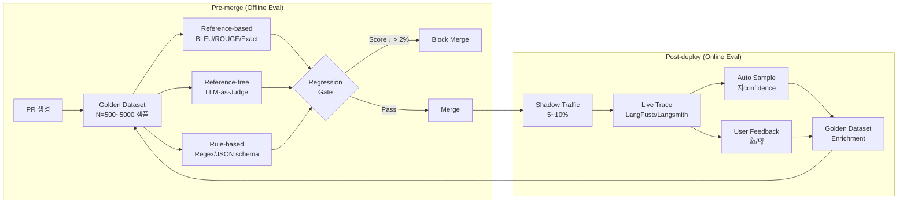

### LLM Eval 자동화 — "QA팀이 샘플링해서 확인하면 되지"라는 순진함, 그리고 프롬프트 한 줄 바꿨더니 전체 챗봇 정답률이 23% 떨어진 걸 3주 뒤 CS 민원 폭주로 발견한 새벽

금융권 챗봇을 운영하는 한 핀테크의 2026년 2월. 프롬프트 엔지니어가 "답변을 더 친근하게"라는 요구를 받고 System Prompt에 `"친근한 말투로 답변해주세요"` 한 줄을 추가해 금요일 저녁 배포했다. 월요일 아침 CS 티켓이 평소의 4배로 쌓였다. 원인을 추적해보니 그 한 줄이 LLM의 **"숫자를 정확히 인용하라"** 지시를 무력화시켜 "약 300만원 정도"처럼 뭉개서 답하기 시작한 것이었다. 복구까지 걸린 시간: 3주. 재무팀 추산 손실: 11억. CTO가 Postmortem에 적은 한 줄 — **"우리는 코드는 CI로 검증했지만, 프롬프트는 눈으로 봤다."**

이 사건은 단일 조직의 실수가 아니라 **"LLM은 결정론적이지 않다"** 는 전제를 Eval 파이프라인으로 번역하지 못한 조직 전체의 구조적 결함이다.

---

#### 왜 unit test로는 안 되는가

전통적 테스트는 `assert output == expected` 이지만 LLM은:
- 같은 입력에 다른 문장이 나온다 (`temperature > 0`)
- 틀렸는지 맞았는지 **의미(semantic)** 로 판단해야 한다
- Regression이 "크래시"가 아니라 "답의 품질이 23% 저하"처럼 **분포 변화** 로 나타난다

→ **"테스트"가 아니라 "통계적 평가(Evaluation)"** 가 필요하다.

---

#### Eval 파이프라인의 3단 구조



핵심은 **Golden Dataset이 운영에서 역류(enrichment)** 되는 피드백 루프다. Dataset이 고정되면 2개월 뒤부터 "통과했는데 실제론 터지는" 상태가 된다.

---

#### 세 가지 Eval 방식의 트레이드오프

| 방식 | 비용 | 신뢰도 | Latency | 커버리지 | 적용 지점 |
|------|------|--------|---------|----------|-----------|
| **Human Eval** | $$$ (샘플당 $2~5) | ★★★★★ | 분~시간 | 매우 낮음 | 최종 Release 전 / Golden 작성 |
| **LLM-as-Judge** | $ (샘플당 $0.001~0.01) | ★★★☆ | 1~3초 | 매우 높음 | PR Gate / Online Sampling |
| **Rule-based** | 거의 0 | ★★★★ (범위 내) | ms | 좁음 | Schema/PII/Format |
| **Reference-based** (BLEU/ROUGE) | 거의 0 | ★★ (의역 취약) | ms | 중간 | 번역·요약 등 정답 명확한 경우 |

**시니어의 실전 조합**: Rule-based로 1차 필터(PII 유출, JSON 깨짐 즉시 fail) → LLM-as-Judge로 품질 점수 → 월 1회 Human Eval로 Judge의 Calibration 검증.

---

#### LLM-as-Judge의 다섯 가지 함정

**함정 1. Position Bias** — Judge에게 A/B 두 응답을 비교시키면 **먼저 보여준 쪽을 60~70% 선호** 한다. → 반드시 **순서를 섞어 양방향 평가** 후 평균.

**함정 2. Verbosity Bias** — 길고 장황한 답을 "자세하다"며 선호한다. 간결한 정답이 lose 처리된다. → Judge 프롬프트에 **"길이는 점수에 반영하지 말라"** 를 명시해도 15% 정도만 완화됨. 길이 분포를 feature로 함께 로깅해야 한다.

**함정 3. Self-preference Bias** — GPT-4로 생성한 답을 GPT-4 Judge로 평가하면 자기 모델을 11% 더 높게 평가한다 (Zheng et al., 2024). → **Judge는 생성 모델과 다른 패밀리** 로 (예: 생성=Claude, Judge=GPT-4o).

**함정 4. Judge Drift** — 몇 달 뒤 Judge 모델이 업데이트되면 **같은 응답에 다른 점수** 가 나온다. → Judge 모델 버전을 **메트릭 메타데이터에 반드시 태그**, 모델 교체 시 Golden Set 전체 **재평가 후 baseline 재설정**.

**함정 5. "LGTM 플레토** — Judge가 모든 응답에 7~8점을 줘서 regression이 안 보인다. → Judge 프롬프트를 **binary pass/fail** 또는 **critique 먼저, 점수 나중** 구조로 바꾸면 분산이 2~3배 늘어난다.

---

#### Prompt / Model Versioning의 숨은 함정

```
┌─────────────────────────────────────────────────────────┐
│  Experiment Registry                                     │
│  ┌───────────────────────────────────────────────────┐  │
│  │ prompt_v  model_id        dataset_v   score  cost │  │
│  │ ─────────────────────────────────────────────────│  │
│  │ v1.3.0    claude-sonnet-4-6   gold-2026-09  0.82  $12 │  │
│  │ v1.3.1    claude-sonnet-4-6   gold-2026-09  0.79  $12 │  │
│  │ v1.3.1    claude-opus-4-7     gold-2026-09  0.91  $47 │  │
│  │ v1.3.1    claude-sonnet-4-6   gold-2026-10  0.73  $12 │ ← dataset drift
│  └───────────────────────────────────────────────────┘  │
└─────────────────────────────────────────────────────────┘
```

세 축이 **독립적으로 버전 관리** 되지 않으면 "저번 주보다 점수가 떨어졌는데 뭘 바꿨는지 모른다"는 상태에 빠진다.
- Prompt는 **Git 또는 Prompt Registry (Humanloop/Langfuse)** 로
- Model은 **snapshot ID** 로 (`claude-opus-4-7` 가 아니라 `claude-opus-4-7-20260601`)
- Golden Dataset은 **DVC/Git LFS 또는 Langsmith Dataset version** 으로

도입 순서 실패 사례: **국내 S 챗봇 플랫폼 (2026)** — Langfuse로 Observability는 깔았으나 Prompt를 코드에 하드코딩한 채 운영. 장애 때 "그 때 어떤 프롬프트였는지" 복원 불가. 포렌식 2주 소요.

---

#### 실제 사례

**사례 1: OpenAI Evals (2023 오픈소스)**
"Model-graded" 패턴을 최초로 체계화. 지금의 LLM-as-Judge 사실상 표준. 주요 교훈: **evals/registry** 에 YAML로 golden set을 선언형으로 관리 → 평가 재현성 확보. CI가 아니라 PR comment로 결과를 흘려보내는 구조가 Anthropic·Mistral·Cohere 모두 유사하게 수렴.

**사례 2: Anthropic 내부 Constitutional AI Eval**
RLHF 전후를 비교하기 위해 **5000개 adversarial prompt + 2명 이상 annotator 합의** 로 Golden 구축. 핵심은 **"disagreement rate가 15% 이상인 샘플은 쓰지 않는다"** — Judge의 ground truth 자체가 애매하면 메트릭이 무너진다. 지금 Claude 4.x 출시 전마다 이 방식의 Eval을 돌린다.

**사례 3: Shopify Sidekick (2024 발표)**
"프롬프트 변경 → PR → eval 자동 실행 → 기존 베이스라인 대비 regression → 자동 block" 파이프라인. **1,200개 goldens, 평가에 평당 7분**, 하루 평균 40회 PR. 비용은 월 $8,000 수준인데, "한 번의 운영 사고 비용이 월 Eval 비용의 50배"라는 계산으로 CFO 설득.

**사례 4: Braintrust (2024 YC)**
Dataset / Experiment / Score를 1급 객체로 다루는 플랫폼. **"프롬프트 바꾼 사람이 자기 평가 점수를 PR에 첨부"** 를 강제하는 워크플로가 특징. 핵심 통찰: "Eval은 QA팀이 아니라 **프롬프트 작성자 본인이 돌리게 해야** 한다. 만든 사람이 책임지지 않으면 고치지 않는다."

**사례 5 (실패): 국내 K 보험사 (2026)**
Eval을 "분기별 QA팀 수작업"으로 운영. 프롬프트 변경 3주 뒤 보험약관 Q&A 챗봇이 "면책사유에 해당하지 않습니다"를 "해당합니다"로 7%의 케이스에서 반전시킨 사실 발견. 피해자 200여명에게 보상 소급. 금감원 현장검사. 사후 Lesson: **"월 1회라도 자동 Eval이 돌았으면 72시간 내에 잡혔다."**

**사례 6: Notion AI (2024)**
배포 전 Golden Dataset 1,500개 + 배포 후 **매일 200개 라이브 샘플 → LLM-as-Judge** → 하향 지표 발견 시 즉시 Slack 알림. **Online Eval이 Offline Eval보다 중요** 하다는 입장. 실제 사용자 쿼리는 Golden과 분포가 다르기 때문.

---

#### ✅ 반드시 Eval 파이프라인을 구축해야 하는 경우

- **규제 산업** (금융/의료/법률): "변경 사항을 어떻게 검증했는가"를 감사자가 묻는다. 코드 리뷰 로그만으론 부족.
- **일 호출 10만 건 이상**: regression이 통계적으로 유의미해지는 분기점. 이 아래는 사람이 눈치챌 수 있다.
- **프롬프트 수정이 주 2회 이상**: 변경 속도가 수작업 QA 캐퍼시티를 넘어선다.
- **멀티 모델 운영**: Routing/Fallback이 있으면 모델별 성능 변화를 지속 추적해야 함.
- **Fine-tuning / Pretraining 운영**: 모델 자체가 바뀌므로 Eval 없이는 배포 불가.

#### ❌ 아직 구축하지 않아도 되는 경우

- **PoC/프로토타입** (사용자 100명 미만): Golden Dataset 작성 공수가 ROI를 넘는다. Human Eval 수십 샘플로 충분.
- **단일 Use Case + 고정 프롬프트**: 변경이 없으면 regression도 없다. 모니터링(fallback error rate)만.
- **내부 사내 도구**: 틀려도 사람이 즉시 알아챈다. 대신 **feedback 버튼**만 넣어라.
- **Golden Dataset을 만들 도메인 전문가가 없다**: Eval 자체가 거짓 신호(garbage in, garbage out). 먼저 전문가 섭외부터.

#### ⚠️ 신중해야 하는 경우

- **창의성이 핵심인 Use Case** (카피라이팅, 아이디에이션): BLEU/ROUGE 무의미, Judge도 "다양성"을 평가하기 어려움. Human preference pairwise comparison 이 유일한 해법인데 비용 폭발.
- **멀티턴 대화**: 턴별로 평가하면 context 효과를 놓치고, 전체 대화를 평가하면 비용·주관성 폭발. **"대화 종료 지점의 goal achievement"** 를 메트릭으로 쓰는 게 현실적.

---

#### 시니어 백엔드가 저지르기 쉬운 네 가지 실수

1. **"Golden Dataset 완성되면 시작하자"** → 100개로 시작해 운영 중 enrichment. 완벽한 1,000개를 기다리면 영영 못 시작한다.
2. **Eval 점수를 평균 하나로 요약** → 전체 평균 0.82인데 특정 카테고리(법률 조항 인용)만 0.41인 걸 놓친다. **반드시 segment별로** 쪼개서 본다 (query type, user cohort, document type).
3. **PR Gate를 너무 엄격하게 (score ↓ 0.5%도 block)** → False positive로 개발자가 Eval을 우회한다. 통계적 유의성 (p-value) 기반 gate가 현실적.
4. **Judge 모델을 "최신으로" 자동 업데이트** → Baseline이 흔들린다. **Judge 모델은 pinned version**, 교체는 분기별로 의도적으로.

---

> 💡 **왜 중요한가**: LLM 시스템에서 "작동한다"는 **진술이 아니라 측정** 이고, Eval 파이프라인 없이 운영하는 조직은 사실상 **눈을 감고 운전** 하는 것과 같다 — 사고는 반드시 나며, 사고 난 뒤에야 핸들을 어디에 뒀는지 찾기 시작한다.
