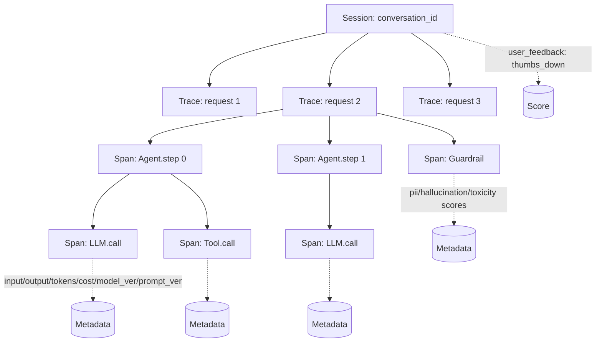

### AI Observability — "print 로그로 충분하다"는 순진함, 그리고 Agent가 왜 그 답을 뱉었는지 아무도 재현 못해 3주 동안 CS 민원 487건이 쌓인 새벽

국내 D 핀테크의 상담 챗봇은 금요일 저녁에 조용히 미쳤다. "제 카드 한도가 왜 줄었나요"라고 묻는 고객에게 "귀하의 신용등급은 7등급으로 평가되어…"라고 답하기 시작했다. 신용등급 조회 Tool은 호출된 적도 없고, 프롬프트에도 등급 추정 지시는 없었다. 운영팀이 "그 대화 로그 좀 주세요"라고 요청하자 백엔드 팀장은 자신 있게 답했다 — "application.log에 다 찍고 있습니다."

열어보니 이렇게 적혀 있었다.

```
2026-09-15 23:47:12 INFO  [chat-service] user=u_8821 msg_len=27
2026-09-15 23:47:14 INFO  [chat-service] llm_call ok tokens=1247 latency=1823ms
2026-09-15 23:47:14 INFO  [chat-service] response sent
```

프롬프트도, 응답 본문도, Tool 호출 순서도, 어떤 모델 버전이었는지도 없었다. "개인정보라서 응답은 안 찍는다"는 보안팀 가이드를 따랐기 때문이다. 결국 "그 사고가 왜 났는지"를 역추적하기 위해, 운영팀은 3주 동안 같은 질문을 챗봇에 15,000번 반복해 재현을 시도했다. 재현되지 않았다. 그 사이 CS 민원 487건이 쌓였고, 금감원 민원 2건이 접수됐으며, 사장은 이렇게 물었다. "그래서, 왜 그런 답을 한 거야?" — 아무도 답하지 못했다.

이 질문은 **LLM 시스템이 전통적인 APM(Application Performance Monitoring)과 왜 근본적으로 다른가**를 드러낸다.

---

#### 1. 왜 전통 APM(DataDog/Jaeger/New Relic)으로는 부족한가

Lv4에서 다룬 분산 트레이싱은 "요청 → 서비스 A → 서비스 B → DB"의 시간/에러를 본다. 입력/출력은 "성공/실패"만 중요하지, 실제 payload는 추상화된다. HTTP 200이면 끝이다.

LLM 시스템은 다르다. **HTTP 200이지만 답이 틀렸다**는 경우가 사고의 99%다. 그래서 관찰해야 할 축이 완전히 다르다.

| 축 | 전통 APM | LLM Observability |
|---|---|---|
| 성공 기준 | HTTP status | **응답 품질 (semantic)** |
| 지연 원인 | DB/Network | **토큰 수, 모델 쿨드스타트, 재시도** |
| 비용 축 | 서버 CPU | **토큰 단가 × 호출 수** |
| 재현성 | 입력 같으면 출력 같음 | **temperature>0 → 매번 다름** |
| 중요 데이터 | 헤더/상태코드 | **프롬프트 전문·응답 전문·모델 버전·프롬프트 버전** |
| 원인 분석 단위 | Request | **Session (대화 전체)** |
| 평가 주체 | 자동(5xx 카운트) | **사람(피드백) + LLM-as-Judge** |

핵심은 마지막 두 줄이다. **단일 Request만 보면 LLM 사고의 원인을 못 찾는다**. "17턴째에 Agent가 자기 전 답변을 오해해서 Tool을 잘못 호출했다" 같은 사고는 Session 단위로 봐야 보인다.

---

#### 2. Trace / Span 설계 — Agent 시대의 핵심

전통적인 Span은 서비스 간 호출을 노드로 삼는다. LLM 시대의 Span은 **LLM 호출 1건, Tool 호출 1건, Agent 1 step**을 각각 노드로 삼는다. 그리고 이걸 **중첩**해야 한다.

```
Session (conversation_id=c_7721, user=u_8821)
└── Trace (request_id=r_a9f3, "카드 한도 왜 줄었나요?")
    ├── Span: Agent.step[0]  (model=claude-opus-4-7, prompt_v=v23)
    │   ├── Span: LLM.call   (input_tokens=1240, output_tokens=180, $0.014)
    │   │   └── decision: tool_use=lookup_user_profile
    │   └── Span: Tool.call  lookup_user_profile(u_8821)
    │       └── result: {grade: 7, limit_change: null}   ← 여기 null인데
    ├── Span: Agent.step[1]  (same model)
    │   └── Span: LLM.call   (input_tokens=1860, output_tokens=240, $0.021)
    │       └── decision: final_answer
    │          "귀하의 신용등급은 7등급으로…"            ← grade를 limit_change로 오해
    └── Span: Guardrail.check
        └── pii_leak=false, hallucination_score=0.73  (↑ 플래그됐어야 함)
```

이 트리를 열어보는 순간, 사고 원인이 10초 만에 보인다. **Tool은 `limit_change: null`을 돌려줬는데, LLM이 다음 턴에서 `grade: 7`을 "한도 축소 사유"로 오해해 답을 생성한 것**. 재현 1만 5천 번이 필요 없다. 트레이스 한 번이면 끝난다.



**핵심 설계 원칙 3가지:**

1. **Span은 LLM 호출 "직전/직후"가 아니라 "요청/응답을 감싼다"** — 재시도, 폴백, 캐시 히트까지 전부 span으로 떨어져야 한다. 재시도 3회가 "일어났다"가 아니라 "각 재시도의 입력/출력/소요 시간"이 다 보여야 한다.
2. **Session ID는 user_id가 아니라 conversation_id** — 같은 유저가 다른 대화를 할 수 있고, 같은 대화를 여러 요청으로 쪼갠다. Session을 잘못 묶으면 "17턴째 오류"를 영원히 못 찾는다.
3. **Score는 사후 주입된다** — 유저가 👎를 2시간 뒤에 눌러도 그 Trace에 소급 attach할 수 있어야 한다. LangSmith/LangFuse 모두 `trace_id` 기반 scoring API를 제공하는 이유다.

---

#### 3. 반드시 캡처해야 하는 메타데이터

"print만 찍는" 백엔드가 가장 자주 빠뜨리는 7가지. 하나라도 없으면 사후 분석이 불가능하다.

| 항목 | 왜 필요한가 | 빠뜨렸을 때의 재앙 |
|---|---|---|
| **프롬프트 전문** (system + messages) | 재현의 유일한 열쇠 | 사고 원인 영구 불명 |
| **응답 전문** (streaming 포함 최종본) | "뭘 답했는지"가 답 | CS 민원 vs 실제 응답 대조 불가 |
| **모델 ID + 버전** (`claude-opus-4-7-20260815`) | provider가 조용히 모델을 업데이트함 | "어제까진 잘 됐는데" 원인 영구 불명 |
| **프롬프트 버전/해시** | 프롬프트는 코드지만 코드가 아닌 척한다 | 롤백 대상이 뭐였는지 불명 |
| **temperature, top_p, seed** | 랜덤성의 원천 | 재현 시 다른 답이 나오면 원인 2중화 |
| **input/output 토큰 수** | 비용 추적 + 컨텍스트 포화 감지 | FinOps 불가, 조용히 월 $12k 폭증 |
| **Tool call 전체 payload** (요청·응답) | Lv5의 사고 70%는 Tool 쪽 | "Agent가 뭘 보고 그런 결정을 했는지" 불명 |

보안팀의 "응답은 PII라 못 찍는다"는 반대에는 **별도 저장소 + 짧은 TTL + 암호화 + 토큰화**로 답한다. 안 찍는 게 아니라, **격리된 곳에 7~30일만 찍는다**. 안 찍으면 사고 분석 자체가 성립하지 않는다.

---

#### 4. 실제 사례

**사례 1: LangSmith (LangChain, 2023 GA)**

LangChain 팀이 자기들이 만든 Agent가 왜 틀리는지 자기들도 몰라서 만든 도구다. 핵심 설계: ① 모든 LLM/Tool 호출을 자동으로 Span화 (`@traceable` 데코레이터), ② Session을 `thread_id`로 묶음, ③ Trace에서 바로 "Playground"로 넘어가 프롬프트를 수정·재실행. "원인 발견 → 수정 → 재실행"의 피드백 루프를 10분으로 압축한 게 Market Fit의 본질이었다.

**사례 2: LangFuse (2023 오픈소스, Self-host)**

유럽 기업들이 LangSmith에 데이터를 못 주겠다고 해서 뜬 오픈소스. 설계는 LangSmith와 거의 동형이지만, **OpenTelemetry 호환 Span을 받는다**. 즉 Jaeger로 보던 트레이스를 LangFuse로도 보낸다. "기존 APM과 공존"이 가능하다는 게 SRE 팀에겐 결정적이었다. 국내 금융권 중 자체 호스팅 요건이 있는 곳(은행·증권)이 2025년부터 이걸로 몰렸다.

**사례 3: Honeycomb (2024, "LLM이 뭐가 특별하냐")**

반대편의 입장. "OpenTelemetry Span 하나로 다 되는데 왜 전용 도구를 쓰냐"는 주장. 실제로 Honeycomb은 LLM 호출을 그냥 custom attribute가 많은 Span으로 다룬다. **장점**: 기존 분산 트레이싱과 완전히 합쳐진 뷰. "DB 쿼리 지연 + LLM 지연"을 같은 Trace에서 본다. **단점**: Prompt Playground, LLM-as-Judge, Session 그루핑 같은 LLM 전용 UX가 없다. 결론: **전통 서비스 비중이 큰 조직엔 Honeycomb, LLM 중심 조직엔 LangSmith/LangFuse**.

**사례 4: 국내 D 핀테크 (2026, 도입부의 그 회사 사후)**

사고 3주 뒤 LangFuse를 self-host했다. 설치 2일, 코드 통합 1주, Session 그루핑 재설계 2주. 두 달 뒤 비슷한 CS 민원이 들어왔을 때 원인 특정에 **17분**이 걸렸다. 원인은 역시 Tool 응답 오해였고, 패치는 프롬프트 1줄이었다. 사후 회고에서 CTO가 적은 한 줄: "우리는 LLM을 로깅 없이 3년을 돌렸다. 데이터베이스 서버를 로깅 없이 돌렸으면 1주일도 못 버텼을 거다."

**사례 5: 국내 K 커머스 (2025, 실패) — "Trace를 100% 저장했다가 월 S3 비용 $4,200"**

Agent 1건이 평균 Span 12개, Span 1개가 평균 payload 8KB. 하루 트래픽 800만 요청이면 하루 저장량 ~770GB. 한 달이면 23TB. S3 Standard로 저장하다 월 $4,200이 찍혔다. **교훈**: Trace도 샘플링한다. 전략은 ① 에러/고비용/저평점만 100%, ② 성공 트래픽은 1~5%, ③ 세션 단위로 샘플링(한 세션은 전부 또는 전무 — "17턴 중 5턴만" 샘플링은 쓸모없다). LangFuse/LangSmith 모두 **tail-based sampling** (요청 끝났을 때 결정)을 지원한다.

**사례 6: 국내 L 보험사 (2026) — Prompt Version을 Observability의 1급 시민으로**

보험 약관 챗봇을 운영하면서, 프롬프트를 Git으로 관리하지 않고 어드민 UI로 수정했다. 어느 날 CS팀이 "답변이 공격적으로 바뀌었다"고 보고. 원인을 Trace에서 보면 `prompt_version=v47`, Git엔 `v46`까지만. 알고 보니 CS 리더가 어드민에서 `v47`로 "말투 좀 더 단호하게"로 수정하고 통보를 안 했다. 그날부터 **프롬프트는 모든 Span에 prompt_hash와 prompt_source(git_sha or admin_edit_id)를 박고**, 어드민 수정 시 자동으로 PR이 올라오게 만들었다. Prompt는 코드다 — 그러면 **버전과 커밋 저자가 Trace에 떨어져야 한다**.

---

#### 5. 안티패턴 (반드시 피할 것)

**함정 1. "로그 라이브러리에 json으로 다 찍으면 되지"**
안 된다. ① Trace의 상하 관계(Agent → LLM → Tool)가 평면 로그에선 복원 안 된다. ② Session 그루핑 불가. ③ Score 사후 attach 불가. ④ 프롬프트 전문이 Elasticsearch index를 터뜨린다. 로그는 Observability가 아니다. **Trace는 그래프, 로그는 리스트**.

**함정 2. Span을 "LLM 호출 1건"에만 거는 것**
그러면 Tool 호출, 재시도, 캐시 히트, Guardrail 체크가 다 안 보인다. 사고의 절반은 LLM이 아니라 Tool에서 난다. **Span은 "결정 가능한 모든 지점"에 건다**.

**함정 3. temperature를 안 찍기**
"어차피 0.7로 고정이야"라고 하지만, 실수로 코드에서 1.3을 넣은 날이 반드시 온다. 재현 안 되는 사고의 원인 1위.

**함정 4. Trace를 Production에서만 켜기**
Staging/Dev에서도 켜야 "개발 중 평가"가 가능하다. 오히려 Dev에서 Trace를 안 보고 짠 Agent가 Production에서 터진다. **Observability는 Dev day 1부터**.

**함정 5. User Feedback(👍👎)을 Trace와 연결 안 함**
Trace와 Score가 분리되어 있으면 "최근 👎가 급증한 Trace의 공통점"을 쿼리할 수 없다. "Prompt v47 배포 이후 👎 비율 2.3배" 같은 분석의 전제 조건이다.

**함정 6. 모든 Trace를 100% 저장**
위 사례 5. 비용이 LLM 비용을 역전한다. **Tail-based 샘플링 + 에러/저점수 100% 보존**.

**함정 7. Guardrail 체크를 Span 밖에서 하기**
Guardrail(PII, hallucination, toxicity)이 Trace 바깥에 있으면 "이 응답이 왜 통과했는지"를 못 본다. Guardrail도 Span이다.

---

#### 6. 트레이드오프: 어떤 도구를 쓸 것인가

| 도구 | 모델 | 강점 | 약점 | 적합 조직 |
|---|---|---|---|---|
| **LangSmith** | SaaS (LangChain) | LLM 전용 UX, Playground, Eval 통합 | 자체 호스팅 비쌈, 데이터 외부 | SaaS 괜찮은 LLM-first 스타트업 |
| **LangFuse** | OSS + SaaS | Self-host 쉬움, OTel 호환 | UX가 LangSmith보다 2보 뒤 | 금융/의료 등 데이터 내부화 필수 |
| **Arize Phoenix** | OSS + SaaS | Eval·Drift·RAG 특화, OTel | Agent trace는 아직 약함 | ML 플랫폼 팀이 운영하는 조직 |
| **Helicone** | Proxy형 SaaS | 통합 1줄 (base_url 교체) | Agent/Tool trace 깊이 얕음 | 빠르게 비용 가시화만 원할 때 |
| **Honeycomb/DataDog** | 전통 APM 확장 | 기존 분산 트레이싱과 통합 | LLM 전용 UX 없음 | LLM이 전체 트래픽의 20% 미만 |
| **자체 OTel + Grafana** | 자체 구축 | 완전 통제, 스택 통일 | 6개월 걸림, Eval은 또 만들어야 | 대기업 플랫폼 팀 |

---

#### 7. 언제 쓰고, 언제 쓰면 안 되는가 (시니어 판단 기준)

**✅ 반드시 도입해야 하는 경우**
- LLM 호출이 하루 1만 건 이상, 또는 월 비용 $500 이상
- Agent/Tool Use가 있는 모든 시스템 (사고의 70%가 여기서 남)
- 외부 고객 노출 챗봇 (사고 → 민원 → 규제)
- 프롬프트를 2명 이상이 수정 (버전 추적 불가하면 사고)
- temperature > 0 (재현성 없음 → Trace가 유일한 증거)

**⚠️ 신중하게 도입하는 경우**
- 사내 개발자 도구(Code 생성 등) — 사고 영향이 적어 Helicone 같은 가벼운 Proxy형으로 충분
- Trace 양이 하루 100만 건 넘는 B2C 대규모 — tail-based 샘플링 설계부터 먼저

**❌ 쓸 필요 없는 경우**
- 1회성 배치 LLM 작업 (log + S3 덤프로 충분)
- Chain이 단일 LLM 호출로 끝나는 간단한 분류기 (전통 APM + prompt/response log면 됨)
- POC/프로토타입 (단, 운영 가면 즉시 도입)

---

#### 8. Lv5 시니어의 체크리스트

- [ ] Session ID = conversation_id로 정의되고 모든 Span에 전파되는가
- [ ] Trace에 프롬프트 전문 + 응답 전문 + 모델 버전 + 프롬프트 버전/해시가 다 붙는가
- [ ] Tool 호출 payload(요청·응답)가 Span의 attribute에 들어가는가
- [ ] temperature/top_p/seed가 Span에 찍히는가
- [ ] 유저 피드백이 trace_id로 소급 attach되는가
- [ ] Guardrail 체크 결과(PII/hallucination/toxicity)가 Span인가
- [ ] Tail-based 샘플링과 "에러·저점수 100% 보존" 규칙이 돌고 있는가
- [ ] 응답 payload의 TTL과 암호화가 보안팀 승인본인가
- [ ] 프롬프트 수정이 Git PR을 거치고, prompt_hash가 Trace에 떨어지는가
- [ ] Dev/Staging에서도 켜져 있는가

> 💡 **왜 중요한가**: LLM 시스템에서 HTTP 200은 "성공"이 아니라 "성공 여부를 모른다"는 뜻이고, Trace 없이 Agent를 운영한다는 건 블랙박스에서 재현 불가능한 사고를 기다리는 것과 같다 — Observability는 선택이 아니라 Day 1부터의 기본 인프라다.
